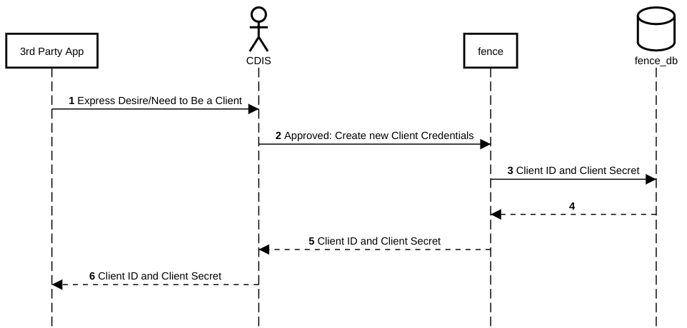
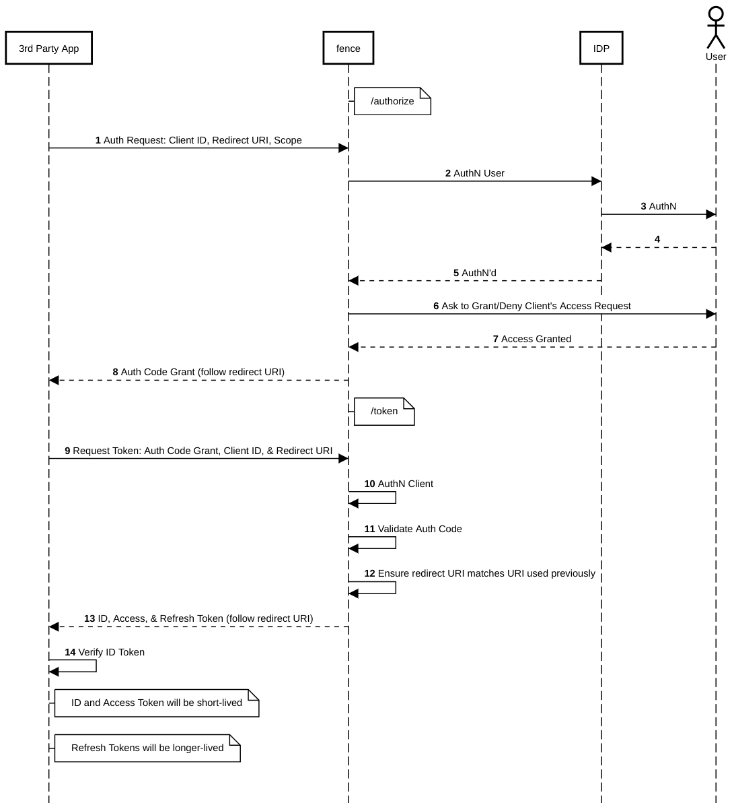
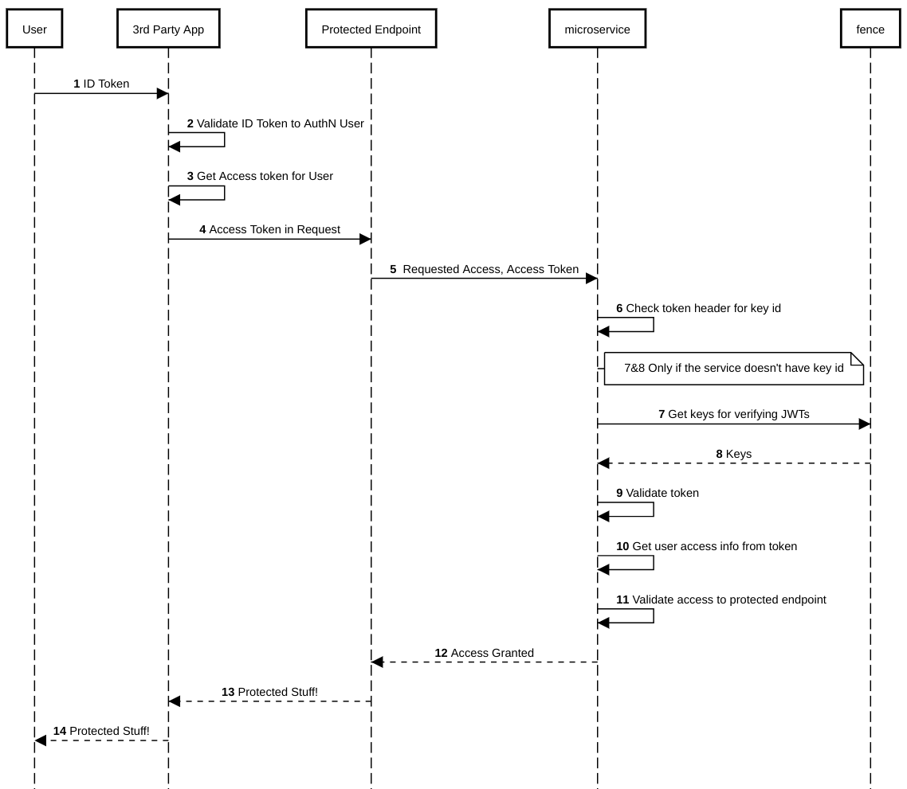
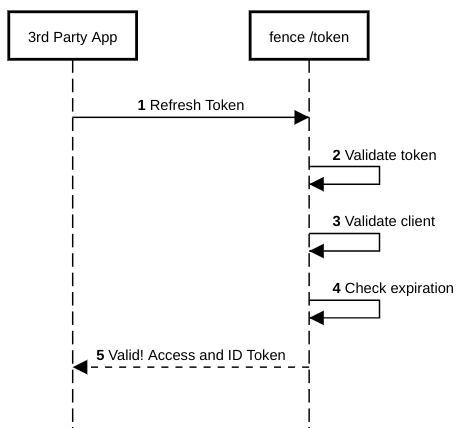
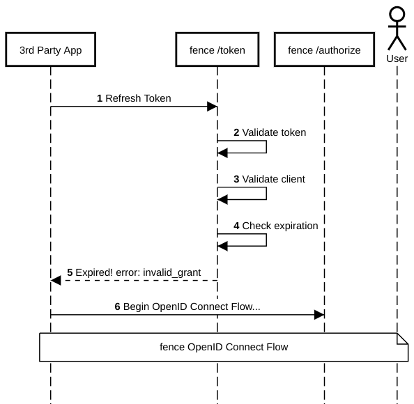
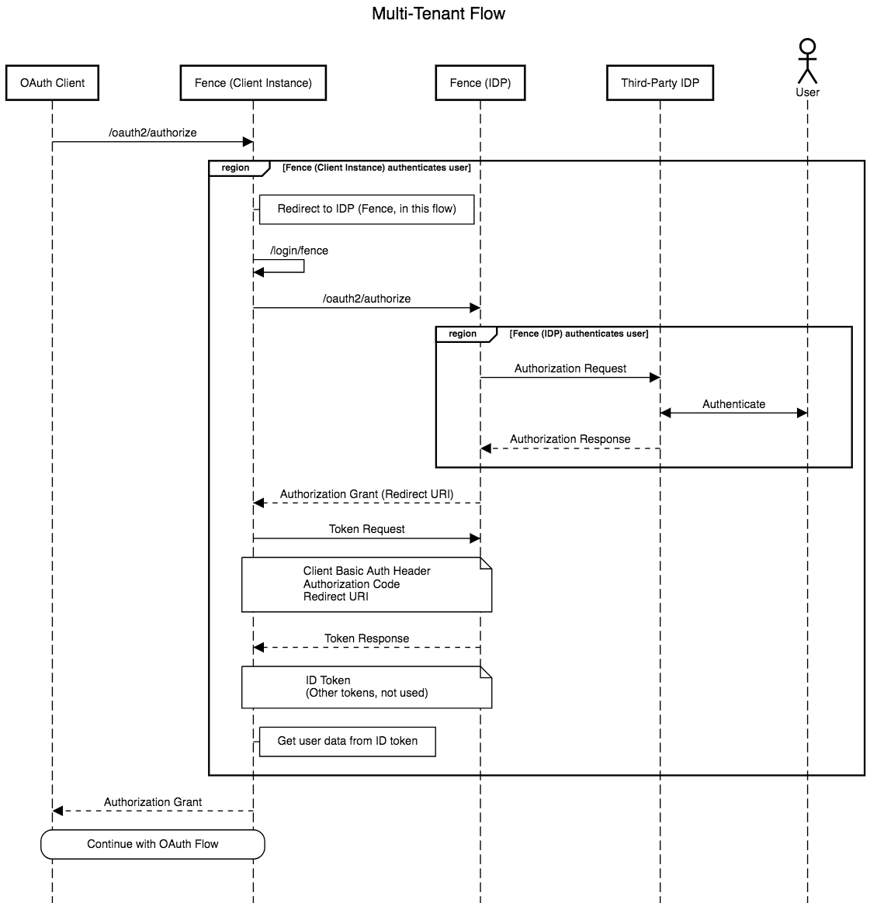

# Fence

[](https://travis-ci.org/uc-cdis/fence)
[](https://www.codacy.com/app/uc-cdis/fence?utm_source=github.com&amp;utm_medium=referral&amp;utm_content=uc-cdis/fence&amp;utm_campaign=Badge_Grade)
[](https://www.codacy.com/app/uc-cdis/fence?utm_source=github.com&utm_medium=referral&utm_content=uc-cdis/fence&utm_campaign=Badge_Coverage)

A `fence` separates protected resources from the outside world and allows
only trusted entities to enter.

Fence is a core service of the Gen3 stack that has multiple capabilities:
1. Act as an [auth broker](#auth-broker) to integrate with one or more [IdPs](#IdP) and provide downstream authentication and authorization for Gen3 services.
2. [Manage tokens](#token-management).
3. Act as an [OIDC provider](#oidc--oauth2) to support external applications to use Gen3 services.
4. [Issue short lived, cloud native credentials to access data in various cloud storage services](#accessing-data)


## Contents

1. [API Documentation](#API-documentation)
1. [Terminologies](#Terminologies)
1. [Identity Providers](#identity-provider)
1. [OIDC & OAuth2](#oidc--oauth2)
1. [Accessing Data](#accessing-data)
1. [Setup](#setup)
1. [Token management](#token-management)
1. [fence-create](#fence-create-automating-common-tasks-with-a-command-line-interface)
1. [Default expiration times](#default-expiration-times-in-fence)


## API Documentation

[OpenAPI documentation available here.](http://petstore.swagger.io/?url=https://raw.githubusercontent.com/uc-cdis/fence/master/openapis/swagger.yaml)

YAML file for the OpenAPI documentation is found in the `openapis` folder (in
the root directory); see the README in that folder for more details.

## Terminologies

#### AuthN

Authentication - establishes "who you are" with the application through communication with an [Identity Provider](#IdP).

#### AuthZ

Authorization - establishes "what you can do" and "which resources you have access to" within the application.

#### IdP

Identity Provider - the service that lets a user login and provides the identity of the user to downstream services. Examples: Google login, University login, NIH Login.

#### Auth broker

An interface which enables a user to authenticate using any of multiple IdPs.

#### OAuth2

A widely used AuthZ protocol for delegating access to an application to use resources on behalf of a user.

https://tools.ietf.org/html/rfc6749

https://oauth.net/2/

##### Client

OAuth 2.0 Client - An application which makes requests for protected resources (on a resource server) on behalf of a resource owner (end-user) and with the resource owner's authorization.

##### Auth Server

OAuth 2.0 Authorization Server - A server which issues access tokens to the client after successfully authenticating the resource owner and obtaining authorization.

##### Access Token

A string, issued by the auth server to the client, representing authorization credentials used to access protected resources (on a resource server).

#### OIDC

OpenID Connect - an extension of OAuth2 which provides an AuthN layer on top of the OAuth 2.0 AuthZ layer. It introduced a new type of token, the id token, that is specifically designed to be consumed by clients to get the identity information of the user.

http://openid.net/specs/openid-connect-core-1_0.html

##### OP

OpenID Provider - an OAuth 2.0 Authentication Server which also implements OpenID Connect.

##### RP

Relying Party - an OAuth 2.0 Client which uses (requests) OpenID Connect.


## Identity Providers

Fence can be configured to support different Identity Providers (IdPs) for AuthN.
At the moment, supported IDPs include:
- Google
- Shibboleth
  - NIH iTrust
  - InCommon
  - eduGAIN


## OIDC & OAuth2

Fence acts as a central broker that supports multiple IdPs.
At the same time, it acts as an IdP itself.
In that sense, `fence` is both an `RP` and an `OP`.

### Fence as RP

Example:

- Google IAM is the OpenID Provider (OP)
- Fence is the Relying Party (RP)
- Google Calendar API is the resource provider

### Fence as OP

- Fence is the OpenID Provider (OP)
- A third-party application is the Relying Party (RP)
- Gen3 microservices (e.g. [`sheepdog`](https://github.com/uc-cdis/sheepdog)) are resource providers

### Example Flows

Note that the `3rd Party App` acts as the `RP` in these examples.

[//]: # (See /docs folder for README on how to regenerate these sequence diagrams)

#### Flow: Client Registration



#### Flow: OpenID Connect

In the following flow, Fence and the IdP together constitute an `OP`.
Fence, by itself, acts as an OAuth 2.0 Auth Server; the IdP enables the additional implementation of OIDC (by providing AuthN). From an OIDC viewpoint, therefore, Fence and the IdP can be abstracted into one `OP`.



If the third-party application doesn't need to use any Gen3 resources (and just
wants to authenticate the user), they can just get
needed information in the `ID token` after the handshake is finished .

#### Flow: Using Tokens for Access

If a third-party application wants to use Gen3 resources like
`fence`/`sheepdog`/`peregrine`, they call those services with an `Access Token`
passed in an `Authorization` header.

In the following flow, `3rd Party App` is the `RP`; `Protected Endpoint` is an endpoint of a Gen3 Resource (the `microservice`), and both of these are part of a `resource server`; and `Fence` is the `OP`. Here, importantly, `Fence` may be interfacing with another IdP _or_ with another `Fence` instance in order to implement the OIDC layer. Either way, note that the `Fence` blob in this diagram actually abstracts Fence in concert with some IdP, which may or may not also be (a different instance of) Fence.



#### Flow: Refresh Token Use



#### Flow: Refresh Token Use (Token is Expired)



#### Flow: Multi-Tenant Fence

The following diagram illustrates the case in which one fence instance
uses another fence instance as its identity provider.

A use case for this is when we setup a fence instance that uses NIH login as the IdP. Here, we go through a detailed approval process in NIH. Therefore we would like to do it only once for a single lead Fence instance, and then allow other fence instances to simply redirect to use the lead Fence as an IdP for logging in via NIH.

In the following flow, `Fence (Client Instance)` is an OP relative to `OAuth Client`, but an RP relative to `Fence (IDP)`.



#### Notes

See the [OIDC specification](http://openid.net/specs/openid-connect-core-1_0.html) for more details.
Additionally, see the [OAuth2 specification](https://tools.ietf.org/html/rfc6749).

## Role-Based Access Control

Currently fence works with another Gen3 service named
[arborist](https://github.com/uc-cdis/arborist) to implement role-based access
control for commons users. The YAML file of access control information (see
[#create-user-access-file]()) contains a section `rbac` which are data sent to
arborist in order to set up the access control model. The information from this
YAML file is loaded into the arborist database so that Gen3 services can make
queries to arborist to determine whether a user is authorized for a particular
request or to list resources which a user has access to. See the
`example_user.yaml` file in the `docs` folder for an example for the structure
for this file. The README for [arborist](https://github.com/uc-cdis/arborist)
has more details about the RBAC system and logic.

## Accessing Data

Fence has multiple options that provide a mechanism to access data. The access
to data can be moderated through authorization information in a User Access File.

Users can be provided specific `privilege`'s on `projects` in the User Access
File. A `project` is identified by a unique authorization identifier AKA `auth_id`.

A `project` can be associated with various storage backends that store
object data for that given `project`. You can assign `read-storage` and `write-storage`
privileges to users who should have access to that stored object data. `read` and
`write` allow access to the data stored in a graph database.

Depending on the backend, Fence can be configured to provide users access to
the data in different ways.


### Signed URLS

Temporary signed URLs are supported in all major commercial clouds. Signed URLs are the most 'cloud agnostic' way to allow users to access data located in different platforms.

Fence has the ability to request a specific file by its GUID (globally unique identifier) and retrieve a temporary signed URL for object data in AWS or GCP that will provide direct access to that object.

### Google Cloud Storage

Whereas pre-signed URL is a cloud agnostic solution, services and tools on Google Cloud Platform prefer to use Google's concept of a "Service Account". Because of that, Fence provides a few more methods to access data in Google.

See [Fence and Google](docs/google_architecture.md) for more details on data access methods specific to Google.

## Setup

#### Install Requirements and Fence

```bash
# Install requirements.
pip install -r requirements.txt
# Install fence in your preferred manner.
python setup.py develop
```

#### Create Configuration File

Fence requires a configuration file to run. We have a command line
utility to help you create one based on a default configuration.

The configuration file itself will live outside of this repo (to
prevent accidentally checking in sensitive information like database passwords).

To create a new configuration file from the default configuration:

```bash
python cfg_help.py create
```

This file will be placed in one of the default search directories for Fence.

To get the exact path where the new configuration file was created, use:

```bash
python cfg_help.py get
```

The file should have detailed information about each of the configuration
variables. **Remember to fill out the new configuration file!**

##### Other Configuration Notes

* Fence will look for configuration files from a list of search directories (
which are currently defined in `fence/settings.py`.)
* For more configuration options (such as having multiple different config
files for development), see the `cfg_help.py` file.

#### Set Up Databases

The tests clear out the database every time they are run. If you want
to keep a persistent database for manual testing and general local usage,
create a second test database with a different name:

> NOTE: Requires a minimum of Postgres v9.4 (because of `JSONB` types used)

```bash
# Create test database(s).
# This one is for automated tests, which clear the database after running;
# `tests/test_settings.py` should have `fence_test_tmp` in the `DB` variable.
psql -U test postgres -c 'create database fence_test_tmp'
userdatamodel-init --db fence_test_tmp
# This one is for manual testing/general local usage; Your config
# should have `fence_test` in the `DB` variable.
psql -U test postgres -c 'create database fence_test'
userdatamodel-init --db fence_test --username test --password test
```

#### Keypair Configuration

Fence uses RSA keypairs to sign and allow verification of JWTs that it issues.
When the application is initialized, Fence loads in keypair files from the
`keys` directory. To store keypair files, use the following procedure:
     - Create a subdirectory in the `fence/keys` directory, named with a
       unique identifier, preferably a timestamp in ISO 8601 format of when
       the keys are created. The name of the directory is used for the `kid`
       (key ID) for those keys; the default (assuming the directory is named
       with an ISO timestamp) looks like this:

           fence_key_2018-05-01T14:00:00Z

     - Generate a private and public keypair following the RSA 256 algorithm
       and store those in that directory. The key files must be named
       `jwt_public_key.pem` and `jwt_private_key.pem`.

To generate a keypair using `openssl`:
```bash
# Generate the private key.
openssl genpkey -algorithm RSA -out jwt_private_key.pem -pkeyopt rsa_keygen_bits:2048

# Generate the public key.
openssl rsa -pubout -in jwt_private_key.pem -out jwt_public_key.pem

# Depending on the `openssl` distribution, you may find these work instead:
#
#     openssl rsa -out private_key.pem 2048
#     openssl rsa -in private_key.pem -pubout -out public_key.pem
```
It's not a bad idea to confirm that the files actually say `RSA PRIVATE KEY`
and `PUBLIC KEY` (and in fact Fence will require that the private key files it
uses actually say "PRIVATE KEY" and that the public keys do not).

Files containing public/private keys should have this format (the format used
by `openssl` for generating RSA keys):
```
-----BEGIN PUBLIC KEY-----
... [key is here] ...
-----END PUBLIC KEY-----
```
If a key is not in this format, then `PyJWT` will raise errors about not being
able to read the key.

Fence will use the first keypair in the list to sign the tokens it issues
through OAuth.


#### Create User Access File

You can setup user access via admin fence script providing a user yaml file
Example user yaml:
```
cloud_providers: {}
groups: {}
users:
  userA@gmail.com:
    projects:
    - auth_id: project_a
      privilege: [read, update, create, delete]
    - auth_id: project_b
      privilege: [read]
  userB@gmail.com:
    projects:
    - auth_id: project_b
      privilege: [read]
```
Example sync command:

```bash
fence-create sync --yaml user.yaml
```

#### Register OAuth Client

When you want to build an application that uses Gen3 resources on behalf of a user, you should register an OAuth client for this app.
Fence right now exposes client registration via admin CLI, because the Oauth2 client for a Gen3 commons needs approval from the sponsor of the commons. If you are an external developer, you should submit a support ticket.

As a Gen3 commons administrator, you can run following command for an approved client:
```bash
fence-create client-create --client CLIENT_NAME --urls OAUTH_REDIRECT_URL --username USERNAME
```
This command should output a tuple of `(client_id, client_secret)` which must be
saved by the OAuth client to use with
`fence`.

## Token management

Fence utilizes [OpenID Connect](#OIDC) to generate tokens
for clients. It can also provide tokens directly to a user.

Clients and users may then use those tokens with other
Gen3 Data Commons services to access protected endpoints that require specific permissions.

We use JSON Web Tokens (JWTs) as the format for all tokens of the following types:

- OIDC ID token: this token is used by the OIDC client to get a user's identity from the token content
- OIDC access token: this token can be sent to Gen3 services via bearer header and get protected resources.
- OIDC refresh token: this token can be sent to fence to request a new access / id token.


### JWT Information

#### Example ID Token

```
{
  "sub": "7",
  "azp": "test-client",
  "pur": "id",
  "aud": [
    "openid",
    "user",
    "test-client"
  ],
  "context": {
    "user": {
      "is_admin": false,
      "name": "test",
      "projects": {
        "phs000178": [
          "read",
          "update",
          "create",
          "delete",
          "read-storage"
        ]
      },
      "google": {
          "linked_google_account": "somebody@example.com"
      }
    }
  },
  "iss": "https://bionimbus-pdc.opensciencedatacloud.org",
  "jti": "3ae2910b-0294-43dc-af2a-03fd60082aef",
  "exp": 1516983302,
  "iat": 1516982102,
  "auth_time": 1516982102
}
```

#### Example Access Token

```
{
  "sub": "7",
  "azp": "test-client",
  "pur": "access",
  "aud": [
    "openid",
    "user",
    "test-client"
  ],
  "context": {
    "user": {
      "is_admin": false,
      "name": "test",
      "projects": {
        "phs000178": [
          "read",
          "update",
          "create",
          "delete",
          "read-storage"
        ]
      },
      "google": {
          "proxy_group": "abcdefgh123456",
          "linked_google_account": "somebody@example.com"
      }
    }
  },
  "iss": "https://bionimbus-pdc.opensciencedatacloud.org",
  "jti": "2e6ade06-5afb-4ce7-9ab5-e206225ce291",
  "exp": 1516983302,
  "iat": 1516982102
}
```

#### Example Refresh Token

```
{
  "sub": "7",
  "azp": "test-client",
  "pur": "refresh",
  "aud": [
    "openid",
    "user",
    "test-client"
  ],
  "iss": "https://bionimbus-pdc.opensciencedatacloud.org",
  "jti": "c72e5573-39fa-4391-a445-191e370b7cc5",
  "exp": 1517010902,
  "iat": 1516982102
}
```

## fence-create: Automating common tasks with a command line interface

fence-create is a command line utility that is bundled with fence and allows you to automate some commons tasks within fence. For the latest and greatest run the command `fence-create --help`.

WARNING: fence-create directly modifies the database in some cases and may circumvent security checks (most of these utilities are used for testing). BE CAREFUL when you're running these commands and make sure you know what they're doing.


#### Register Internal Oauth Client

As a Gen3 commons administrator, if you want to create an oauth client that skips user consent step, use the following command:

```bash
fence-create client-create --client CLIENT_NAME --urls OAUTH_REDIRECT_URL --username USERNAME --auto-approve
```

#### Register an Implicit Oauth Client

As a Gen3 commons administrator, if you want to create an implicit oauth client for a webapp:

```bash
fence-create client-create --client fancywebappname --urls 'https://betawebapp.example/fence
https://webapp.example/fence' --public --username fancyapp --grant-types 'authorization_code
refresh_token
implicit'
```

If there are more than one URL to add, use space to delimit them like this:

```bash
fence-create client-create --urls 'https://url1/' 'https://url2/' --client ...
```

#### Modify OAuth Client

```bash
fence-create client-modify --client CLIENT_NAME --urls http://localhost/api/v0/oauth2/authorize
```

That command should output any modifications to the client. Similarly, multiple URLs are
allowed here too.

#### Delete OAuth Client

```bash
fence-create client-delete --client CLIENT_NAME
```
That command should output the result of the deletion attempt.

#### List OAuth Clients

```bash
fence-create client-list
```
That command should output the full records for any registered OAuth clients.

#### Set up for External Buckets on Google

```bash
fence-create link-external-bucket --bucket-name demo-bucket
fence-create link-bucket-to-project --bucket_id demo-bucket --bucket_provider google --project_auth_id test-project
```

The link-external-bucket returns an email for a Google group which needs to be added to access to the bucket `demo-bucket`.

#### Notify users who are blocking service account registration

```bash
fence-create notify-problem-users --emails ex1@gmail.com ex2@gmail.com --auth_ids test --google_project_id test-google
```

`notify-problem-users` emails users in the provided list (can be fence user email or linked google email) who do not have access to any of the auth_ids provided. Also accepts a `check_linking` flag to check that each user has linked their google account.
## Default Expiration Times in Fence

Table contains various artifacts in fence that have temporary lifetimes and their default values.

> NOTE: "SA" in the below table stands for Service Account

| Name                                 | Lifetime     | Extendable? | Maximum Lifetime      | Details
|--------------------------------------|--------------|-------------|-----------------------|------------------------------------------------------------------------------------------|
| Access Token                         | 20 minutes   | TRUE        | Life of Refresh Token |                                                                                          |
| Refresh Token                        | 30 days      | FALSE       | N/A                   |                                                                                          |
| User's SA Account Access             | 7 days       | TRUE        | N/A                   | Access to data (e.g. length it stays in the proxy group). Can optionally provide an expiration less than 7 days                                 |
| User's Google Account Access         | 1 day        | TRUE        | N/A                   | After AuthN, how long we associate a Google email with the given user. Can optionally provide an expiration less than 1 day                    |
| User's Google Account Linkage        | Indefinite   | N/A         | N/A                   | Can optionally provide an expiration less than 1 hour                                    |
| Google Signed URL                    | Up to 1 hour | FALSE       | N/A                   | Can optionally provide an expiration less than 1 hour                                    |
| AWS Signed URL                       | Up to 1 hour | FALSE       | N/A                   | Obtained by an oauth client through /credentials/google                                  |
| Client SA (for User) Key             | 10 days      | FALSE       | N/A                   | Obtained by the user themselves for temp access. Can optionally provide an expiration less than 10 days                              |
| User Primary SA Key                  | 10 days      | FALSE       | N/A                   | Used for Google URL signing                                                              |
| User Primary SA Key for URL Signing  | 30 days      | FALSE       | N/A                   |                                                                                          |
| Sliding Session Window               | 30 minutes   | TRUE        | 8 hours               | access_token cookies get generated automatically when expired if session is still active |
