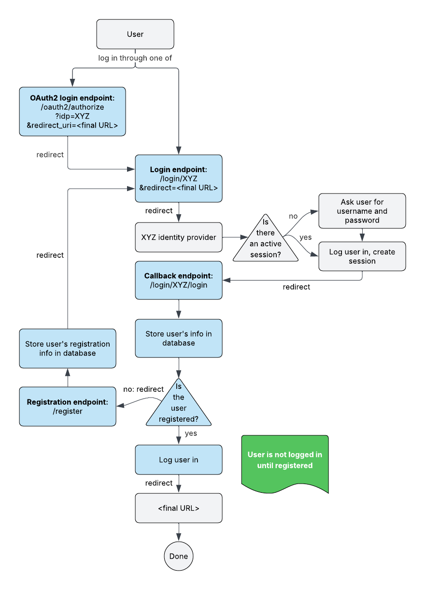

# User Registration

## Description

The user registration functionality is an optional feature. It enables a registration form for users to provide basic information (such as name, organization, and email) **after** logging in with an identity provider, but **before** being granted access to any non-public pages or resources.

Once registered, users are logged in and (if configured) automatically added to a preconfigured Arborist group.

An admin endpoint `/admin/register` is available to list registered users and their information.

**Notes:**
1. The user information provided during registration is NOT currently validated in any way.
2. The registration page and form are NOT currently customizable.

## Configuration

- Set `REGISTER_USERS_ON` to `true` in the Fence configuration.
- Optionally, set `REGISTERED_USERS_GROUP` to the name of an Arborist group users should be added to once registered.

## Technical flow



## Automatic registration

Alternatively, user registration can be enabled without redirecting users to a form where they enter their information manually. If `enable_idp_users_registration` is enabled in the identity provider's `OPENID_CONNECT` configuration, the user's information is automatically parsed from the JWT token received from the identity provider and stored in the Fence database.

```
REGISTER_USERS_ON: true
OPENID_CONNECT:
    <identity provider>:
        [...]
        enable_idp_users_registration: true
```

**Notes:**
1. The automatic registration gets the user's information from the following claim fields and is NOT currently customizable.
    - firstname
    - lastname
    - org
    - email

## Testing steps for non-automatic registration

- Set up a useryaml that has a GROUP with a policy (for example: "registered_users" with "data_upload" policy)
- Your test user should not be in this group
- Set up and run your Arborist
- Run usersync
- Put the name of the group in fence config's REGISTERED_USERS_GROUP; also set fence REGISTER_USERS_ON to true.
- Look in the Fence db and confirm that your test user is not registered (he has no registration_info block in his additional_info column)
- Look in Arborist db and confirm that your test user is not part of the group and does not have the group's policies
- Set up and run your Fence, which is talking to your Arborist
- Log in. You should be redirected to the registration form!
- Register.
- Check Arborist db and confirm that now your test user IS part of the group and DOES have the group's policies.
- Check Fence db and confirm that the registration info you entered is now in the additional_info column.
- Log out. Log in again. There should be no redirect to the registration form.
- You can hit /user/register directly to re-register.
- Now log in with a user that is an admin. Hit the /user/admin/register endpoint. You should see user's registration info.
