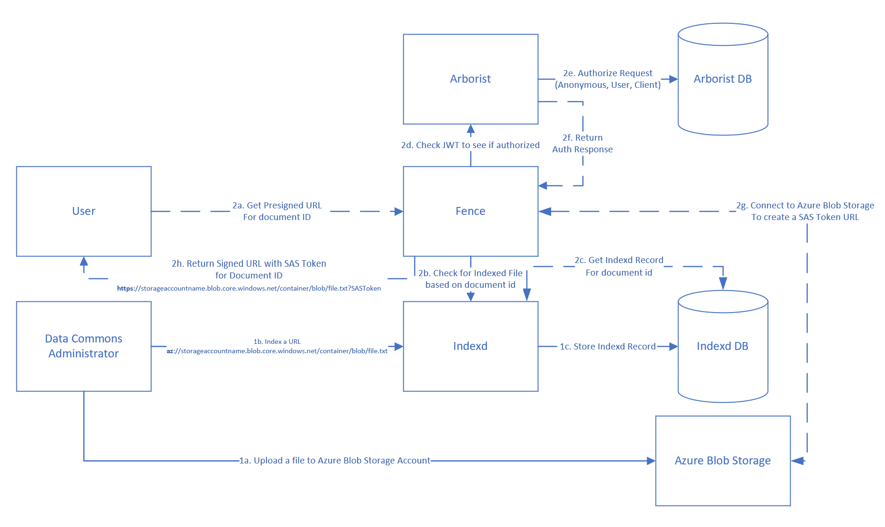
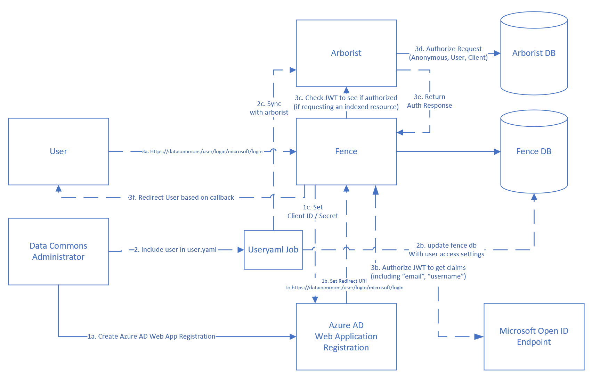
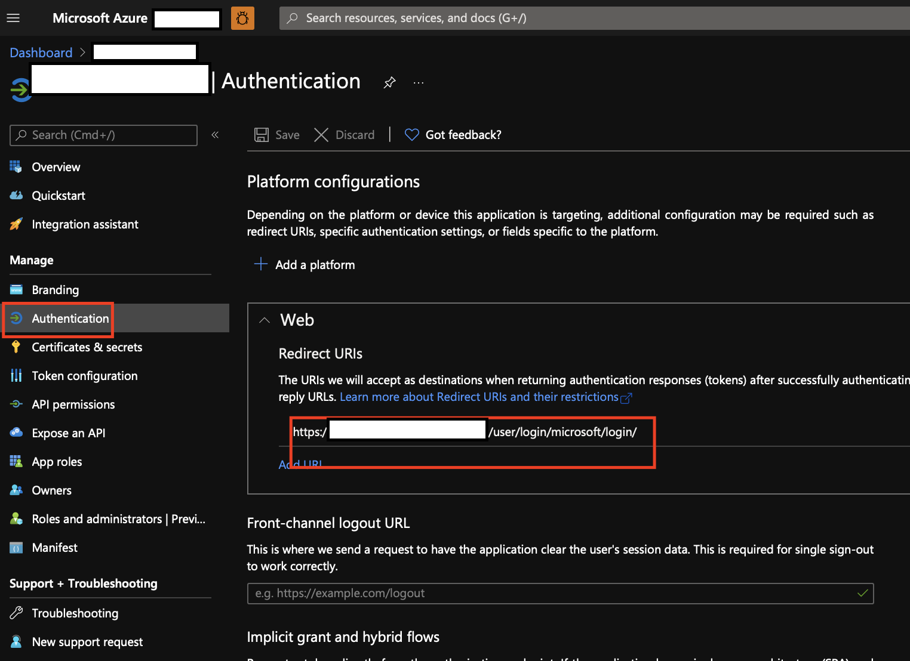
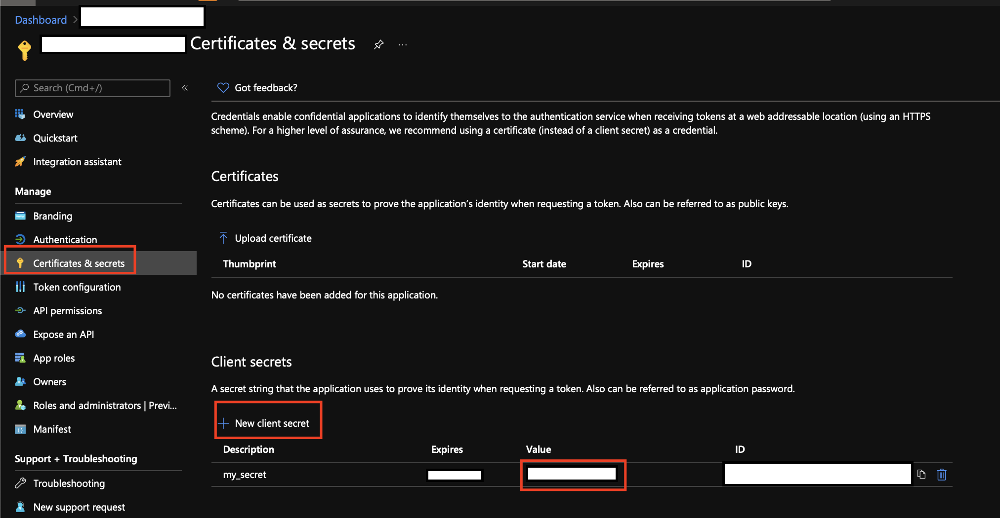
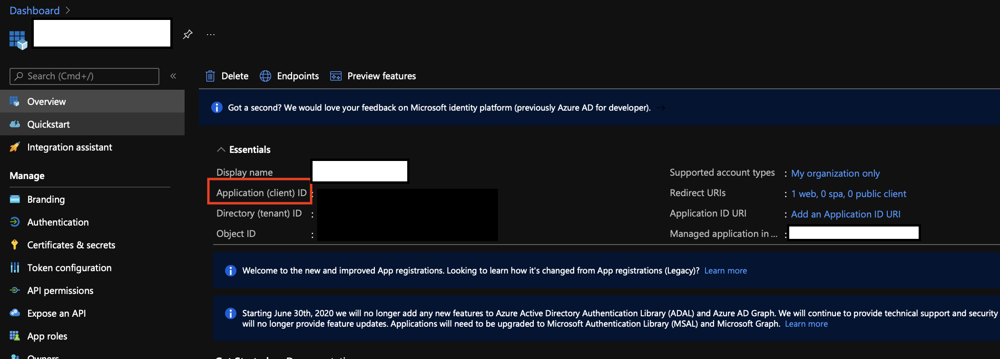

# Fence and Microsoft

## Data Access Overview

Fence can issue short lived, cloud native credentials to access data in various cloud storage services. For Microsoft, you can use a [signed URL](#Signed-URLs) with [Azure Blob Storage](#Azure-Blob-Storage)
and you can authenticate with [Azure AD](#Azure-Active-Directory).

## Implementation and Architectural Details

You can review how `fence` works with [Azure Blob Storage](#Azure-Blob-Storage) and [Azure Active Directory](#Azure-Active-Directory).

### Azure Blob Storage



The diagram shows 2 separate workflows in order for `fence` to interact with [Azure Blob Storage](https://docs.microsoft.com/en-us/azure/storage/blobs/storage-blobs-introduction):

1. [Indexing an existing file](#Indexing-existing-files) in Azure Blob Storage
2. Getting a [Signed URL](#Signed-URLs) for a file in Azure Blob Storage

You can also check the [configuration details](#Configuration-Details) for using Azure Blob Storage with `fence`.

Also note that there's alternatives that could be considered for [future development](#Future-Considerations).

#### Indexing existing files

You can provision an Azure Storage Account with [Blob Storage as a one-time setup](https://docs.microsoft.com/en-us/azure/storage/blobs/storage-quickstart-blobs-portal). You can further make the blobs [public read only](https://docs.microsoft.com/en-us/azure/storage/blobs/anonymous-read-access-configure?tabs=portal) for dev / test purposes, but it would be advisable to avoid this setup in a production scenario and consider using non-public ones instead.

With the Azure Blob Storage Account setup, you can further upload files into your Blob Storage using [Azure Storage Explorer](https://azure.microsoft.com/en-us/products/storage/storage-explorer/) for manual testing, or you can automate loading data files into Azure Blob Storage (e.g. using [Azure Blob Storage Python SDK](https://github.com/Azure/azure-sdk-for-python/tree/main/sdk/storage/azure-storage-blob)).

Assuming that you have preexisting files in an Azure Blob Storage Account, you can work through the following steps to index the files:

1. Get the Azure Blob Storage URL (e.g. `https://storageaccountname.blob.core.windows.net/container/blob/file.txt`) for the file that's been uploaded, along with other file metadata (e.g. MD5 hash, file size, file name).
2. Submit a request to [indexd](https://github.com/uc-cdis/indexd) to create a new record using [gen3sdk-python](https://github.com/uc-cdis/gen3sdk-python/blob/master/gen3/index.py#L354) including the Azure Blob Storage URL.  You should update the URL to indicate using `az` as the protocol for Azure Blob Storage, for example `https://storageaccountname.blob.core.windows.net/container/blob/file.txt` will become `az://storageaccountname.blob.core.windows.net/container/blob/file.txt`. You can also set the `acl` to `'*'` and **not set** `authz` in the `indexd` record if you want to create a public `indexd` record.
3. `Indexd` should be able to create a record and track the new [indexd record](https://github.com/uc-cdis/indexd#indexd-records) in its database, and return a `documentid` along with other metadata

#### Signed URLs

Assuming the user can send a request to `fence` with an indexed `documentid` and a JWT token, `fence` can then check with `indexd` to validate the `documentid` exists and retrieve the indexd record. The indexd record includes `authz` and `acl` information, which `fence` will use to check with [arborist](https://github.com/uc-cdis/arborist) to see if the [JWT token is authorized](https://github.com/uc-cdis/arborist/blob/0d89490b3bd6cdaea99a1296caf32209eb6939f3/arborist/server.go#L367).

If the user is authorized by `arborist`, `fence` can use the [Azure Blob Storage Python SDK](https://github.com/Azure/azure-sdk-for-python/tree/main/sdk/storage/azure-storage-blob) to interact with Azure Blob Storage. The Azure Blob Storage client needs a [connection string](https://docs.microsoft.com/en-us/azure/storage/common/storage-account-keys-manage?toc=%2Fazure%2Fstorage%2Fblobs%2Ftoc.json&tabs=azure-portal#view-account-access-keys) in order to connect to Azure Blob Storage.

You can use the Azure Blob Storage client to connect to Azure Blob Storage, and given a converted indexed [URL](https://docs.microsoft.com/en-us/rest/api/storageservices/naming-and-referencing-containers--blobs--and-metadata#resource-uri-syntax), you can create a [SAS Token](https://docs.microsoft.com/en-us/azure/storage/common/storage-sas-overview) to include with the signed URL (e.g. `https://storageaccountname.blob.core.windows.net/container/blob/file.txt?SASToken`) for the user to access the Azure Blob Storage based file in the Data Commons.

#### Configuration Details

You can update the [Fence config.yaml](../../fence/config-default.yaml) to include the following values:

| Name                    | Value                                                                                                                                                        | Description                                                                                                                                                                                                                                                                                                                                                                                                                                                                                                                                                                                                                                                                                                                                                                                                                                                                                                      |
|-------------------------|--------------------------------------------------------------------------------------------------------------------------------------------------------------|------------------------------------------------------------------------------------------------------------------------------------------------------------------------------------------------------------------------------------------------------------------------------------------------------------------------------------------------------------------------------------------------------------------------------------------------------------------------------------------------------------------------------------------------------------------------------------------------------------------------------------------------------------------------------------------------------------------------------------------------------------------------------------------------------------------------------------------------------------------------------------------------------------------|
| `AZ_BLOB_CREDENTIALS`   | DefaultEndpointsProtocol=https;AccountName=somestorageaccount;AccountKey=storageaccountkey;BlobEndpoint=`https://somestorageaccount.blob.core.windows.net/`; | This is the [Azure Blob Storage Connection String](https://docs.microsoft.com/en-us/azure/storage/common/storage-account-keys-manage?toc=%2Fazure%2Fstorage%2Fblobs%2Ftoc.json&tabs=azure-portal#view-account-access-keys). You can also set this to `'*'` if you are indexing URLs for [public read access Azure Blob Storage containers](https://docs.microsoft.com/en-us/azure/storage/blobs/anonymous-read-access-configure?tabs=portal). Note that if you're using the URL for a public read access Azure Blob Storage container, then operations such as `delete` and `upload` will not work.                                                                                                                                                                                                                                                                                                              |
| `AZ_BLOB_CONTAINER_URL` | `https://storageaccountname.blob.core.windows.net/storage-container`                                                                                         | This is the destination container for uploading with a given SAS token. You can set this value to designate a pre-existing storage container to upload indexed files, for example the new files could sit in `https://storageaccountname.blob.core.windows.net/storage-container/someguid/some/blob/file.txt`. If the storage account doesn't align with the indexed URL (e.g. you're using a public url or the storage account doesn't match), the upload will not work. If `AZ_BLOB_CREDENTIALS` is `'*'` then uploads from an indexed file using a public URL will not work. This value should be associated with the same Azure Blob Storage account used with the [Azure Blob Storage Connection String](https://docs.microsoft.com/en-us/azure/storage/common/storage-account-keys-manage?toc=%2Fazure%2Fstorage%2Fblobs%2Ftoc.json&tabs=azure-portal#view-account-access-keys) for `AZ_BLOB_CREDENTIALS`. |

Using pre-signed urls for download is implemented; it's currently using a [SAS Token](https://docs.microsoft.com/en-us/azure/storage/common/storage-sas-overview).

An example might look like the following url:

```bash
https://<storageaccount>.blob.core.windows.net/<containername>/some/path/to/file.txt?<sastoken>
```

For example, when you index the file (e.g. using the [gen3sdk](https://github.com/uc-cdis/gen3sdk-python/blob/master/gen3/index.py#L354)), you can supply the url associated with the blob that's already been uploaded in the Azure Blob Storage Container.
> `fence` will take an indexed version of the URL with `az` protocol instead of `https`, such as `https://storageaccountname.blob.core.windows.net/container/blob/file.txt` vs. `az://storageaccountname.blob.core.windows.net/container/blob/file.txt`

So if you navigate to `https://mydatacommons/files/guid` (assuming that the metadata is already setup), you can click on the file to download which will make the call to get the appropriate signed URL.


* If you index the file with a URL for a blob in a **public** Azure Blob Storage Container and the `AZ_BLOB_CREDENTIALS` are set to `'*'`, then the **non-signed** converted indexed URL will be used (e.g. `https://<publicstorageaccount>.blob.core.windows.net/<containername>/some/path/to/file.txt`)
  > You need to replace the URL such as `https://<publicstorageaccount>.blob.core.windows.net/<containername>/some/path/to/file.txt` with `az://<publicstorageaccount>.blob.core.windows.net/<containername>/some/path/to/file.txt` upon submitting the record to `indexd`.
* If you index the file with a URL for a blob in a **non-public** Azure Blob Storage Container, you can still set the `AZ_BLOB_CREDENTIALS` to your Azure Blob Storage [Connection string](https://docs.microsoft.com/en-us/azure/storage/common/storage-account-keys-manage?toc=%2Fazure%2Fstorage%2Fblobs%2Ftoc.json&tabs=azure-portal#view-account-access-keys), which will allow `fence` to generate a SAS token to use with the **signed** converted indexed URL (e.g. `https://<storageaccount>.blob.core.windows.net/<containername>/some/path/to/file.txt?<sastoken>`)
  > You need to replace the URL such as `https://<storageaccount>.blob.core.windows.net/<containername>/some/path/to/file.txt` with `az://<storageaccount>.blob.core.windows.net/<containername>/some/path/to/file.txt` upon submitting the record to `indexd`.

#### Future Considerations

You could also consider using an [Azure Data Share](https://docs.microsoft.com/en-us/azure/data-share/overview), which will let you [share from blob storage](https://docs.microsoft.com/en-us/azure/data-share/how-to-share-from-storage). This would allow for sharing based on blob snapshots, and would be an alternative to sharing instead of using the SAS token approach for signed URLs. This may also be an interesting consideration for sharing data with Azure Blob Storage from other data sources like [Azure Data Lake Storage or Azure SQL Database](https://docs.microsoft.com/en-us/azure/data-share/supported-data-stores#supported-data-stores).

You can use [user delegation SAS tokens](https://docs.microsoft.com/en-us/rest/api/storageservices/create-user-delegation-sas) as a further refinement of the SAS token approach for the signed URLs. With this approach, you can use Azure AD credentials to sign the SAS token instead of the Azure Storage Account Key.

`Fence` could also support a `storage` parameter so that indexed files do not require an indexed URL with a protocol representing the storage layer (as this would allow storing the URL's like `https://storageaccountname.blob.core.windows.net/container/blob/file.txt` with indexd instead of using `az://storageaccountname.blob.core.windows.net/container/blob/file.txt`).

---

### Azure Active Directory



The diagram shows 3 separate workflows in order for `fence` to interact with Azure AD:

1. Creating an [Azure AD Web App Registration](#Azure-AD-Registration)
2. Adding users through the [User Yaml](#User-Yaml-Setup) job.
3. Logging in with Microsoft credentials through [Azure AD](#Login-with-AAD) with Fence

Also note that there's alternatives that could be considered for [future development](#AAD-Considerations).

#### Azure AD Registration

`Fence` uses [OpenID Connect](https://docs.microsoft.com/en-us/azure/active-directory/develop/v2-protocols-oidc) built on Oauth 2.0 to interact with Azure Active Directory.

> This has been tested with a [single tenant scenario](https://docs.microsoft.com/en-us/azure/data-explorer/provision-azure-ad-app#create-azure-ad-application-registration).

`Fence` will need to be configured to use the Azure AD Web App registration, which will be covered in the following steps:

1. [Create](https://docs.microsoft.com/en-us/azure/data-explorer/provision-azure-ad-app) AAD Application
2. Add a redirect URL
    * The application needs to have redirect URL that is the FDQN of commons appended with `(commons fdqn)/user/login/microsoft/login`.

3. Set a secret for the AAD application

4. Retrieve the `client id` of the AAD application

5. Update [fence-config.yaml](../../fence/config-default.yaml)
    * Set the `microsoft_client_id` to be the `client_id` in step 4.
    * Set the `microsoft_client_secret` to be the secret value in step 3.
    * Make sure the `BASE_URL` in [fence-config.yaml](../../fence/config-default.yaml) is correct.
    * Make sure the `redirect_url` in [fence-config.yaml](../../fence/config-default.yaml) is `{{BASE_URL}}/login/microsoft/login/` is matches the redirect URL (`(commons fdqn)/user/login/microsoft/login`) in step 2
6. Restart `fence` service with the updated secrets

#### User Yaml Setup

`Fence` uses [Arborist](https://github.com/uc-cdis/arborist) as an underlying ABAC policy engine.

It's helpful to understand some of the [Arborist terms and definitions](https://github.com/uc-cdis/arborist#terminology-and-definitions), which covers **action**, **permission**, **role**, **resource**, **policy**, and **group**.

Further, it's helpful to understand the Arborist options for [configuring access](https://github.com/uc-cdis/arborist#configuring-access). You can see an example of granting **users** and **groups** access and more details in the [user.yaml guide](../additional_documentation/user.yaml_guide.md).

At a high level, this setup involves a couple steps:

1. Update the [user.yaml](#Update-user-yaml)
2. Run the [user.yaml job](#Run-User-Yaml-Job)

##### Update user yaml

You can update the user.yaml to include users for fence in the `user.yaml`:

```diff
fence:
    config:
      ...
      user:
        emails:
+          - "new.user@contoso.com"
+          - "another.user@contoso.com"
        resources:
+          - program: Program1
+            projectCode: P1
+            projectName: project1
+          - program: Program2
+            projectCode: P2
+            projectName: project2
```

The more complete example may look like the following in the `user.yaml`:

```diff

    authz:
      # policies automatically given to anyone, even if they are not authenticated
      anonymous_policies:
      - open_data_reader
      - data_upload

      # policies automatically given to authenticated users (in addition to their other policies)
      all_users_policies:
      - data_upload

      groups:
      # can CRUD programs and projects and upload data files
      - name: data_submitters
        policies:
        - services.sheepdog-admin
        - data_upload
        - MyFirstProject_submitter
        users:
+        - new.user@contoso.com
+        - another.user@contoso.com

      # can create/update/delete indexd records
      - name: indexd_admins
        policies:
        - indexd_admin
        users:
+        - new.user@contoso.com
+        - another.user@contoso.com

      resources:
      - name: workspace
      - name: data_file
      - name: services
        subresources:
        - name: sheepdog
          subresources:
          - name: submission
            subresources:
            - name: program
            - name: project
      - name: open
+      - name: programs
+        subresources:
+        - name: Program1
+          subresources:
+          - name: projects
+            subresources:
+            - name: P1
+        subresources:
+        - name: Program2
+          subresources:
+          - name: projects
+            subresources:
+            - name: P2
+      - name: projects
+        subresources:
+        - name: project1
+        - name: project2

      policies:
      - id: workspace
        description: be able to use workspace
        resource_paths:
        - /workspace
        role_ids:
        - workspace_user
      - id: data_upload
        description: upload raw data files to S3
        role_ids:
        - file_uploader
        resource_paths:
        - /data_file
      - id: services.sheepdog-admin
        description: CRUD access to programs and projects
        role_ids:
          - sheepdog_admin
        resource_paths:
          - /services/sheepdog/submission/program
          - /services/sheepdog/submission/project
      - id: indexd_admin
        description: full access to indexd API
        role_ids:
          - indexd_admin
        resource_paths:
          - /programs
      - id: open_data_reader
        role_ids:
          - reader
          - storage_reader
        resource_paths:
        - /open
      - id: all_programs_reader
        role_ids:
        - reader
        - storage_reader
        resource_paths:
        - /programs
      - id: MyFirstProject_submitter
        role_ids:
        - reader
        - creator
        - updater
        - deleter
        - storage_reader
        - storage_writer
        - admin
        resource_paths:
        - /programs

      roles:
      - id: file_uploader
        permissions:
        - id: file_upload
          action:
            service: fence
            method: file_upload
      - id: workspace_user
        permissions:
        - id: workspace_access
          action:
            service: jupyterhub
            method: access
      - id: sheepdog_admin
        description: CRUD access to programs and projects
        permissions:
        - id: sheepdog_admin_action
          action:
            service: sheepdog
            method: '*'
      - id: indexd_admin
        description: full access to indexd API
        permissions:
        - id: indexd_admin
          action:
            service: indexd
            method: '*'
      - id: admin
        permissions:
          - id: admin
            action:
              service: '*'
              method: '*'
      - id: creator
        permissions:
          - id: creator
            action:
              service: '*'
              method: create
      - id: reader
        permissions:
          - id: reader
            action:
              service: '*'
              method: read
      - id: updater
        permissions:
          - id: updater
            action:
              service: '*'
              method: update
      - id: deleter
        permissions:
          - id: deleter
            action:
              service: '*'
              method: delete
      - id: storage_writer
        permissions:
          - id: storage_creator
            action:
              service: '*'
              method: write-storage
      - id: storage_reader
        permissions:
          - id: storage_reader
            action:
              service: '*'
              method: read-storage

    clients:
      wts:
        policies:
        - all_programs_reader
        - open_data_reader
    users:
+      new.user@contoso.com:
+        policies:
+          - workspace
+          - MyFirstProject_submitter
+          - data_upload
+          - services.sheepdog-admin
+          - all_programs_reader
+          - open_data_reader
+      another.user@contoso.com:
+        policies:
+          - workspace
+          - MyFirstProject_submitter
+          - data_upload
+          - services.sheepdog-admin
+          - all_programs_reader
+          - open_data_reader

    cloud_providers: {}
    groups:
    - data_submitters
    - indexd_admins
```

##### Run User Yaml Job

If you're using the [cloud automation repo](https://github.com/uc-cdis/cloud-automation), there's also a kubernetes job for syncronizing the settings in [user.yaml](https://github.com/uc-cdis/cloud-automation/blob/master/kube/services/jobs/useryaml-job.yaml) with the `Fence db`.


#### Login with AAD

Assuming that the prior steps are run for creating the Azure AD Web App registraion and user.yaml have, you can login with `fence` using Azure AD.

When you click on the Microsoft Login option, you'll work through the [Open ID Connect](https://docs.microsoft.com/en-us/azure/active-directory/develop/v2-protocols-oidc) flow using Microsoft Azure AD.
> For the purposes of this guide, some of the authentication details are kept at a high level as the reference documentation can step through the scenario in greater depth.

In the case the user can login with their Microsoft login, `fence` will attempt to use an authorization code to retrieve a JWT from AAD.

This JWT will be evaluated to see if there's a `username` and `email` included in the claims.

> If the `email` claim isn't available as part of your IDP (e.g. through AAD with a 3rd party), you should reach out to your IDP administrator to make sure the claim is included.

If the user is looking to access other scoped resources (such as indexed files), then `fence` will also check with [Arborist](https://github.com/uc-cdis/arborist) to validate that the [JWT has appropriate permissions](https://github.com/uc-cdis/arborist/blob/0d89490b3bd6cdaea99a1296caf32209eb6939f3/arborist/server.go#L367) (whether anonymous, user, or client) to the requested resource.

#### AAD Considerations

While using Azure AD Web Application registrations has been tested with a single tenant, you could consider a multi-tenant app registration, which would involve some additional changes:

* [Add Publisher Verification](https://docs.microsoft.com/en-us/azure/active-directory/develop/publisher-verification-overview)
* [Convert App to Multi-tenant](https://docs.microsoft.com/en-us/azure/active-directory/develop/howto-convert-app-to-be-multi-tenant), which may require additional code changes in [Fence](https://dev.azure.com/DataCommons/ProjectDataCommons/_git/fence?path=%2Ffence%2Fresources%2Fopenid%2Fmicrosoft_oauth2.py&version=GBazure-support&line=41&lineEnd=49&lineStartColumn=13&lineEndColumn=87&lineStyle=plain&_a=contents).
