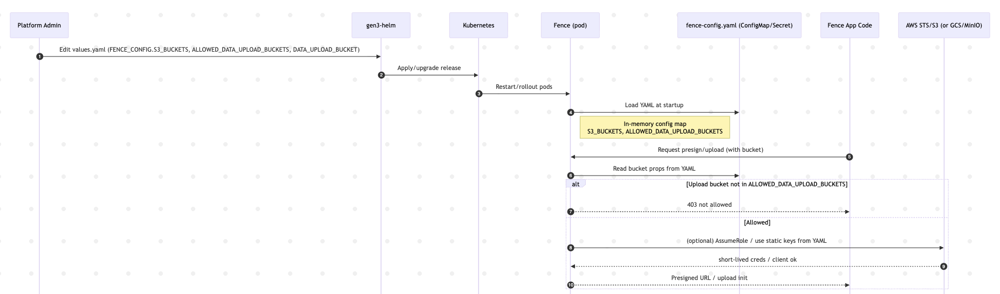
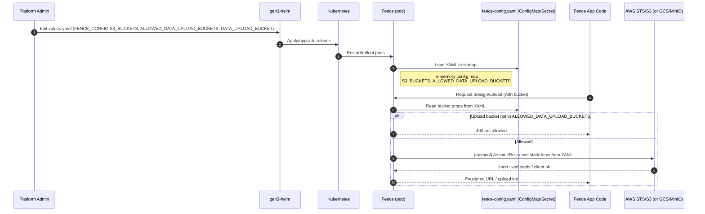
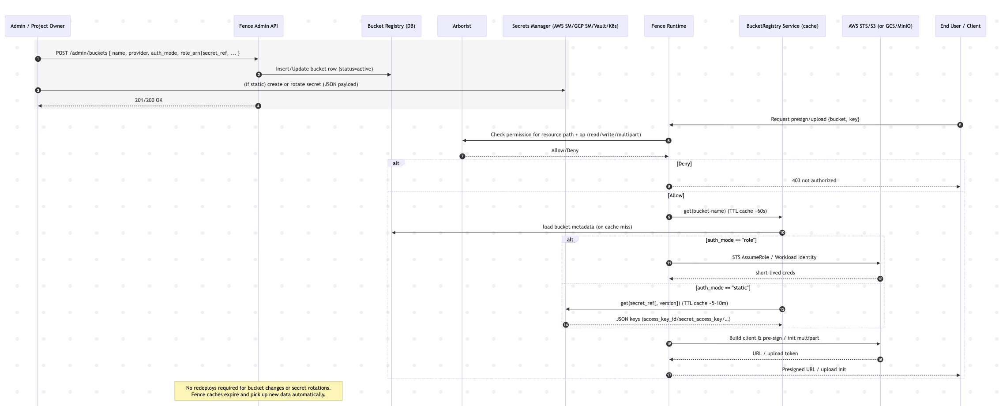
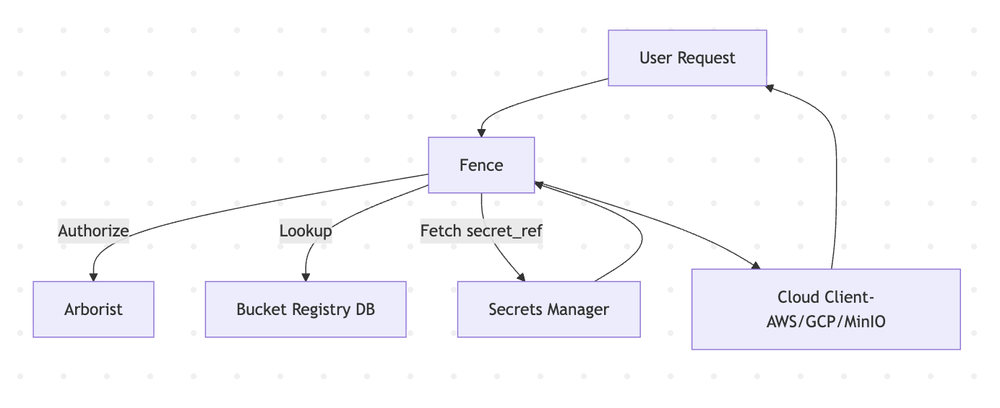
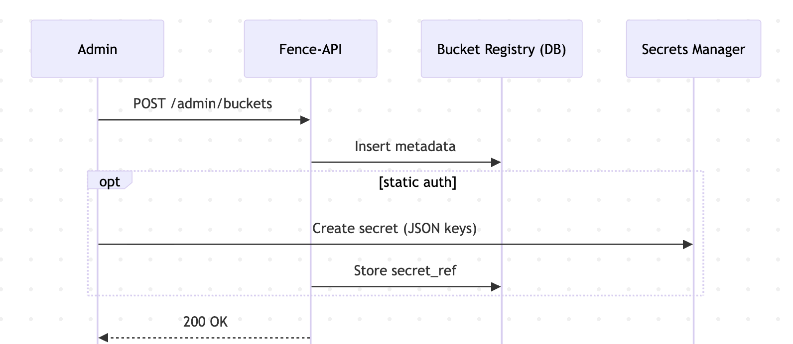
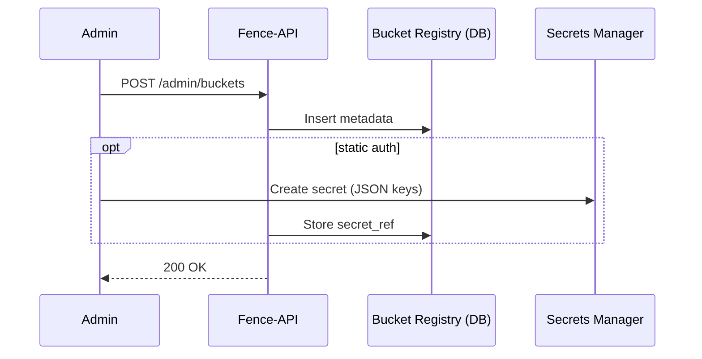

# Dynamic Bucket Configuration & Secrets Manager Integration
**Architecture Overview**

## Table of Contents
1. [Current State: How Buckets Are Configured](#current-state-how-buckets-are-configured)
2. [Motivation for Change](#motivation-for-change)
3. [Proposed Strategy](#proposed-strategy)
4. [Implementation Plan](#implementation-plan)
   - [Data Model](#data-model)
   - [Secrets Manager Integration](#secrets-manager-integration)
   - [Admin API](#admin-api)
   - [Runtime Flow](#runtime-flow)
   - [Rotation Strategy](#rotation-strategy)
   - [Operations & Security](#operations--security)
5. [Migration Path](#migration-path)
6. [Architecture Diagrams](#architecture-diagrams)
7. [Summary](#summary)

---

## Current State: How Buckets Are Configured

### In Fence
- Fence loads runtime configuration from `fence-config.yaml`.
- Bucket-related keys:
  - `S3_BUCKETS`: Known buckets for signed URL generation and object operations.
  - `ALLOWED_DATA_UPLOAD_BUCKETS`: Allow-list for uploads.
  - `DATA_UPLOAD_BUCKET`: Legacy default bucket.
- Fence uses these structures to issue short-lived credentials and presigned URLs.

### In gen3-helm
- Helm injects the config file into Fence pods via `fence.FENCE_CONFIG`.
- Any change requires a Helm redeploy.

**Problem**: Buckets are static and tied to infrastructure deployment. Adding or rotating a bucket requires DevOps intervention.

#### Today: static buckets from fence-config.yaml (Helm-driven)




---

## Motivation for Change
- Enable **dynamic bucket management** without redeploying.
- Allow **project owners** or admins to self-manage buckets.
- Support **credential rotation** without downtime.
- Improve **security** by removing static secrets from Helm/configmaps.

### After changes: dynamic Bucket Registry + external Secrets Manager



```mermaid
sequenceDiagram
    autonumber
    participant Admin as Admin / Project Owner
    participant API as Fence Admin API
    participant DB as Bucket Registry (DB)
    participant Arborist as Arborist
    participant SM as Secrets Manager (AWS SM/GCP SM/Vault/K8s)
    participant Fence as Fence Runtime
    participant BR as BucketRegistry Service (cache)
    participant Cloud as AWS STS/S3 (or GCS/MinIO)
    participant User as End User / Client

    rect rgb(245,245,245)
    Admin->>API: POST /admin/buckets { name, provider, auth_mode, role_arn|secret_ref, ... }
    API->>DB: Insert/Update bucket row (status=active)
    Admin->>SM: (if static) create or rotate secret (JSON payload)
    API-->>Admin: 201/200 OK
    end

    User->>Fence: Request presign/upload {bucket, key}
    Fence->>Arborist: Check permission for resource path + op (read/write/multipart)
    Arborist-->>Fence: Allow/Deny
    alt Deny
        Fence-->>User: 403 not authorized
    else Allow
        Fence->>BR: get(bucket-name)  (TTL cache ~60s)
        BR->>DB: load bucket metadata (on cache miss)
        alt auth_mode == "role"
            Fence->>Cloud: STS AssumeRole / Workload Identity
            Cloud-->>Fence: short-lived creds
        else auth_mode == "static"
            BR->>SM: get(secret_ref[, version]) (TTL cache ~5–10m)
            SM-->>BR: JSON keys (access_key_id/secret_access_key/…)
        end
        Fence->>Cloud: Build client & pre-sign / init multipart
        Cloud-->>Fence: URL / upload token
        Fence-->>User: Presigned URL / upload init
    end

    Note over API,DB,SM: No redeploys required for bucket changes or secret rotations.<br/>Fence caches expire and pick up new data automatically.

```

---

## Proposed Strategy

1. **Registry in Database** — Buckets become rows in a DB table, not static YAML entries.
2. **Management API** — Admin endpoints to create, update, suspend, and list buckets.
3. **Runtime Resolver** — Fence caches registry entries and resolves credentials on demand.
4. **Secrets Manager Integration** — Role-based preferred (STS, Workload Identity). Static keys stored externally (AWS SM, GCP SM, Vault, or K8s).
5. **Policy Enforcement** — Arborist governs who can use which bucket/prefix.

---

## Implementation Plan

### Data Model
- Table: `bucket`
- Fields: `name`, `provider`, `region`, `endpoint`, `auth_mode`, `role_arn`, `secret_ref`, `secret_version`, `status`, `owner_project`, `labels`.

### Secrets Manager Integration
- **SecretResolver** abstraction with pluggable backends:
  - `AwsSecretsManagerResolver`
  - `GcpSecretManagerResolver`
  - `VaultResolver`
  - `KubernetesSecretResolver`
- Secrets never stored in DB; only `secret_ref` (ARN/path).
- Cached in memory (5–10 min TTL).

### Admin API
- Endpoints:
  - `GET /admin/buckets`
  - `POST /admin/buckets`
  - `PATCH /admin/buckets/{name}`
  - `DELETE /admin/buckets/{name}` (soft suspend)
- Requires Arborist policy: `bucket_admin`.

### Runtime Flow
1. User requests presign.
2. Fence authorizes via Arborist → looks up registry entry.
3. If role-based → AssumeRole / Workload Identity.
4. If static → fetch secret from resolver.
5. Build cloud client → presign URL.

### Rotation Strategy
- **AWS SM/GCP SM**: Fence reads `latest`. Rotation functions create new versions.
- **Vault**: Dynamic leases; Fence refreshes before expiry.
- **Manual**: Admin PATCHes bucket with new `secret_version`.

### Operations & Security
- Fence pod identity has **read-only** access to secrets.
- Nightly drift detection job verifies IAM/KMS alignment.
- Audit logs for bucket admin API actions.
- Backward compatibility: YAML used if registry empty.

---

## Migration Path
1. Deploy DB migration (`bucket` table).
2. Run `fence-create sync-buckets-from-yaml`.
3. For static buckets: create secret and PATCH bucket with `secret_ref`.
4. Enable `FENCE_ENABLE_DYNAMIC_BUCKETS=true`.
5. Redeploy once; future changes via API.

---

## Architecture Diagrams

### High-Level Flow



```mermaid
flowchart TD
    U[User Request] --> F[Fence]
    F -->|Authorize| A[Arborist]
    F -->|Lookup| R[Bucket Registry DB]
    F -->|Fetch secret_ref| S[Secrets Manager]
    S --> F
    F --> C[Cloud Client (AWS/GCP/MinIO)]
    C --> U
```

### Admin Workflow





---

## Summary
This architecture:
- Moves bucket definitions from Helm config into a **database registry**.
- Adds a **management API** for admin/project-owner workflows.
- Integrates with **external secrets managers** for security and rotation.
- Provides **backward compatibility** with YAML until fully migrated.
- Reduces DevOps overhead, increases user autonomy, and strengthens security posture.
