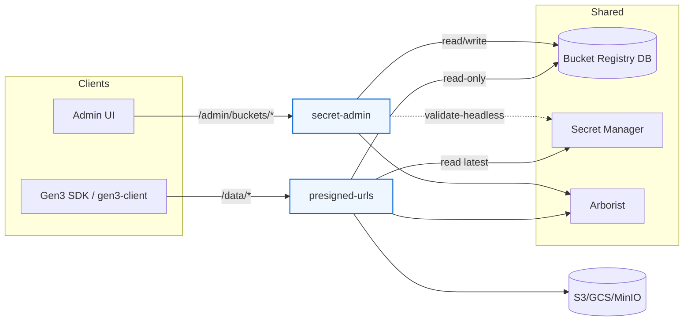
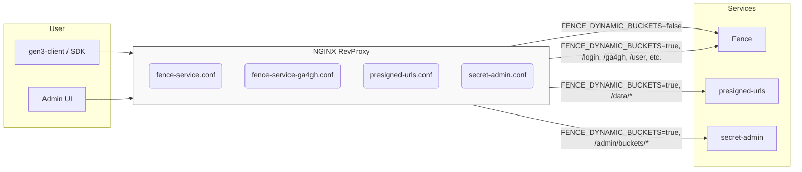

# Split Architecture: `presigned-urls` & `secret-admin`

This package contains a focused **architecture + rollout plan** to split signing from admin into two services:

- **`presigned-urls`** — high-throughput signer (download/upload single + multipart), read-only DB + secrets access.
- **`secret-admin`** — low-QPS (queries per second) admin CRUD + validation for the bucket registry, write access to DB; validate-only access to secrets/STS.

## 1) High-level Architecture



**Separation of concerns**
- `presigned-urls`: *read-only* DB, read secrets or assume-role, generate presigned URLs. No DB writes.
- `secret-admin`: CRUD + validate; never returns raw secrets; enforces admin RBAC.

## 2) Responsibilities & APIs

### A) `presigned-urls`
**Endpoints (Fence-compatible):**
- `GET /data/download/{guid}` → signed GET
- `POST /data/upload` → single-part presign (PUT)
- `POST /data/multipart/init` → init multipart
- `POST /data/multipart/upload` → presign part
- `POST /data/multipart/complete` → complete upload

**Flow:**
AuthN (JWT) → AuthZ (Arborist vs indexd record authz) → Registry lookup → Secret/STS → Presign → Return URL/302.

**Config:** `REGISTRY_DSN` (read-only), `SECRETS_BACKEND`, cache TTLs, rate limits.

### B) `secret-admin`
**Endpoints:**
- `GET /admin/buckets`
- `POST /admin/buckets`
- `PATCH /admin/buckets/{name}`
- `DELETE /admin/buckets/{name}` (suspend)
- `POST /admin/buckets/{name}/resume`
- `POST /admin/buckets/{name}/validate` (dry-run)

**Flow (validate):**
AuthN → Admin RBAC → resolve secret/assume role → optional HEAD to storage → return `{ok, reason}` (no secrets).

## 3) Data Model (Shared DB)

- `bucket(id, name, provider, region, endpoint, auth_mode, role_arn, secret_ref, status, owner_project, labels, created_at, updated_at, authz, data_upload_allowed, is_default)`
- Optional: `bucket_prefix`, `bucket_policy_binding`, `bucket_audit`

**Access:**
- `presigned-urls`: **SELECT** only.
- `secret-admin`: **CRUD** + audit.

## 4) Security Model

- Least-privilege IAM/RBAC per service account (K8s/IAM).
- Secrets are never returned; only used.
- NetworkPolicy limits egress to DB / Secrets / Arborist / Cloud.
- JWT audiences per service; Arborist authorization for both.
- Audit admin mutations; log validations (without secrets).

## 5) Performance & Caching

- In-memory TTL caches: buckets (5–10m), secrets (5m), STS sessions (reuse until T-5m).
- Presign p99 target < 150ms internal; admin p99 < 500ms.
- Stateless signer; scale horizontally behind LB.

## 6) Compatibility & Fork Plan

- Fork Fence signing blueprints for `/data/*` only; keep response shapes identical.
- Swap `fence_config.S3_BUCKETS` → **RegistryAccessor**.
- Keep Indexd client layer for GUID → locations.
- Admin endpoints implemented only in `secret-admin`.

## 7) Deployment (K8s)

- **presigned-urls**: replicas N, `presign-sa`, HPA, PDB, readiness/liveness, rate-limit.
- **secret-admin**: replicas 2, `secret-admin-sa`, strong egress policy.
- Shared: `global.registry.dsn`, `global.secrets.backend`, `global.arborist.url`.

## 8) Observability & SLOs

- Metrics: presign latency histograms, cache hit rates, STS/Secrets latency, 4xx/5xx per route.
- Logs: request IDs, authz decisions, storage op (no secrets).
- Tracing: spans across Signer → Arborist → Secrets → Cloud.
- SLOs: signer p99 < 150ms, error rate < 0.1%.

## 9) Testing Strategy

- Contract tests vs Fence reference responses.
- Unit: RegistryAccessor, SecretResolver backends, STS adapter.
- Integration: Localstack/MinIO presign & multipart; admin CRUD + validate.
- Security: ensure no secret values in logs/responses.
- Load: 1–5k RPS signer; watch STS throttling, cache efficacy.

## 10) Rollout Steps

1. Migrate YAML → DB (one-shot).
2. Deploy `secret-admin`, gate with RBAC, seed buckets.
3. Deploy `presigned-urls`, optionally shadow traffic.
4. Route `/data/*` to `presigned-urls` at ingress (keep Fence as fallback).
5. Monitor metrics/logs; compare to baseline.
6. Disable signing in Fence (or keep thin proxy/shim).

## 11) Minimal Interfaces

```python
class RegistryAccessor:
    def get_bucket(self, name: str) -> "Bucket": ...
    # secret-admin only:
    def list_buckets(self, filters: dict = ...) -> list["Bucket"]: ...
    def upsert_bucket(self, b: "Bucket") -> None: ...
    def set_status(self, name: str, status: str) -> None: ...

class SecretResolver:
    def get(self, ref: str, version: str | None = None) -> dict[str, str]: ...
```


# Routing to Presigned-URL and Secret-Admin Services

This note describes how ingress routing changes when introducing the **`presigned-urls`** and **`secret-admin`** services.
The routing is controlled by a feature flag:

```yaml
FENCE_DYNAMIC_BUCKETS: false   # default
```

---

## 1. Feature Flag

* **`FENCE_DYNAMIC_BUCKETS=false` (default)**

  * Fence behaves as today: all endpoints are served by the Fence service itself.
  * Reverse proxy includes the standard configs:

    * [`fence-service-ga4gh.conf`](https://github.com/uc-cdis/gen3-helm/blob/master/helm/revproxy/gen3.nginx.conf/fence-service-ga4gh.conf)
    * [`fence-service.conf`](https://github.com/uc-cdis/gen3-helm/blob/master/helm/revproxy/gen3.nginx.conf/fence-service.conf)

* **`FENCE_DYNAMIC_BUCKETS=true`**

  * Split service deployment. Fence continues to handle auth flows and GA4GH endpoints.
  * Presign and bucket-admin endpoints are served by new services.
  * Reverse proxy includes:

    * [`presigned-urls.conf`](https://github.com/uc-cdis/gen3-helm/blob/master/helm/revproxy/gen3.nginx.conf/presigned-urls.conf)
    * [`secret-admin.conf`](https://github.com/uc-cdis/gen3-helm/blob/master/helm/revproxy/gen3.nginx.conf/secret-admin.conf)

---

## 2. Routing Overview



---

## 3. Deployment Strategy

1. **Add feature flag** to `fence-config.yaml` or Helm `values.yaml`:

```yaml
global:
  fence:
    FENCE_DYNAMIC_BUCKETS: false
```

2. **Helm template conditionals**:
   Update `gen3-helm/helm/revproxy/templates/configmap.yaml` (or equivalent) to select config files:

```yaml
{{- if eq .Values.global.fence.FENCE_DYNAMIC_BUCKETS false }}
include: fence-service.conf
include: fence-service-ga4gh.conf
{{- else }}
include: presigned-urls.conf
include: secret-admin.conf
{{- end }}
```

3. **Rolling update**:

   * Deploy with `FENCE_DYNAMIC_BUCKETS=false` for backward compatibility.
   * Switch to `true` once the presigned-urls and secret-admin services are deployed and healthy.
   * Monitor logs and `/data/*` presign endpoints for correct routing.

---

## 4. Guardrails

* Always keep **only one** set of configs active (Fence vs split).
* `presigned-urls` should be horizontally scalable, stateless.
* `secret-admin` should be locked down by RBAC and exposed only to admin endpoints.
* Audit and metrics must distinguish traffic routed to each service.

