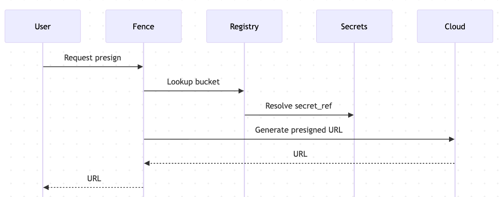

---

marp: true
theme: default
paginate: true
---

# Fence Dynamic Buckets  

## Technical Architecture Meeting

---

## Agenda

- [Architecture Overview](./ARCHITECTURE_OVERVIEW.md)  
- [Use Cases](./use_cases.md)  
- [Dynamic Bucket Configuration](./DYNAMIC_BUCKET_CONFIG.md)  
- [Database Schema](./FENCE_CHANGES_Implementation.md#1-database-schema-sql)  
- [Admin API Endpoints](./FENCE_CHANGES_Implementation.md#2-endpoint-specs-adminonly)  
- [Integration Points](./FENCE_CHANGES_Implementation.md#3-patch-points-in-fence-swap-config-lookups--registry-accessor)  
- [OpenAPI Additions](./FENCE_CHANGES_Implementation.md#4-minimal-openapi-additions-merge-into-fence-spec)  
- [Guardrails & Notes](./FENCE_CHANGES_Implementation.md#5-guardrails--notes)  
- [Secrets Implementation](./SECRETS_Implementation.md)  
- [Acceptance Tests](./ACCEPTANCE_TESTS.md)  

---

## User-Focused Use Cases

### **Data Submitters**

- Upload large genomic datasets (TBs) directly to their institutional S3  
- Avoid expensive data transfer costs between clouds  
- Maintain compliance with institutional data policies  

### **Research Teams**  

- Connect existing project buckets with years of analysis results  
- Share data across collaborators without duplicating storage  
- Keep sensitive data in approved organizational accounts  

### **Platform Administrators**

- Onboard new institutions without code deployments  
- Rotate compromised credentials instantly via API  
- Audit all bucket access through centralized logs  

---

## Technical Use Cases

- Add/update buckets **without redeploying**  
- Rotate credentials seamlessly  
- Enforce project-level authorization with Arborist  
- Support AWS, GCP, MinIO, on-prem  
- Analysts register buckets securely  

### Architecture Overview


---

## Dynamic Bucket Configuration

- Metadata in DB: name, provider, region, endpoint, auth_mode  
- `secret_ref` points to external secret (not stored in DB)  
- Status: active/suspended  
- Labels for grouping  
- Cache with TTLs  

---

## Database Schema

- [Schema details](./FENCE_CHANGES_Implementation.md#1-database-schema-sql)  
- Tables:  
  - `bucket` (main metadata)  
  - `bucket_prefix` (optional)  
  - `bucket_policy_binding`  
  - `bucket_audit`  

---

## Admin API Endpoints

- `GET /admin/buckets`  
- `POST /admin/buckets`  
- `PATCH /admin/buckets/{name}`  
- `DELETE /admin/buckets/{name}`  
- `POST /admin/buckets/{name}/resume`  
- `POST /admin/buckets/{name}/validate`  

---

## Integration Points



---

## OpenAPI Additions

- [Spec updates](./FENCE_CHANGES_Implementation.md#4-minimal-openapi-additions-merge-into-fence-spec)  
- New schemas: `BucketCreate`, `BucketUpdate`  
- Protected by Arborist `bucket_admin` policy  

---

## Guardrails & Notes

- Feature flag: `FENCE_ENABLE_DYNAMIC_BUCKETS`  
- Backward compatibility with YAML  
- Strong IAM/RBAC for secret access  
- Audit logs for admin actions  
- Cache TTLs → seamless secret rotation  

---

## Secrets Implementation

- [Secrets doc](./SECRETS_Implementation.md)  
- **AWS Secrets Manager** (preferred)  
- **Kubernetes Secrets** (mount or API mode)  
- Extensible: Vault, GCP SM  
- Resolver abstraction: `SecretResolver.get(ref)`  


---

## Acceptance Tests

- Seed DB with role/static buckets → presign OK  
- Mock STS assume role + secret resolver  
- Upload/download flows validated  
- Secret rotation → new presign valid after TTL expiry  
- Admin API integration tests  

---

## Next Steps

- Apply DB migrations in staging  
- Validate admin APIs & secret resolver flows  
- Enable flag in dev cluster  
- Plan migration from YAML → DB  

---

## Q & A

```text
    ██████╗ 
   ██╔═══██╗
   ██║   ██║
   ██║▄▄ ██║
   ╚██████╔╝
    ╚══▀▀═╝ 
      ██    
      ╚═╝    
```
