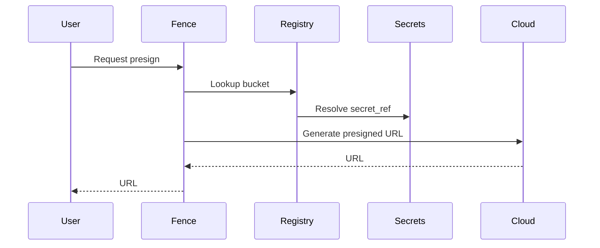
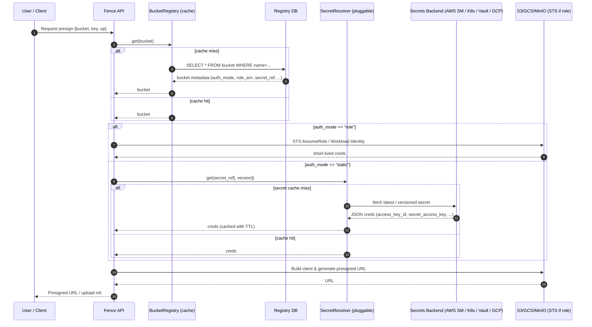

## integration

```mermaid
sequenceDiagram
    participant User
    participant Fence
    participant Registry
    participant Secrets
    participant Cloud

    User->>Fence: Request presign
    Fence->>Registry: Lookup bucket
    Registry->>Secrets: Resolve secret_ref
    Fence->>Cloud: Generate presigned URL
    Cloud-->>Fence: URL
    Fence-->>User: URL
```

## secrets

```mermaid
sequenceDiagram
    autonumber
    participant User as User / Client
    participant Fence as Fence API
    participant BR as BucketRegistry (cache)
    participant DB as Registry DB
    participant Resolver as SecretResolver (pluggable)
    participant SM as Secrets Backend (AWS SM / K8s / Vault / GCP)
    participant Cloud as S3/GCS/MinIO (STS if role)

    User->>Fence: Request presign {bucket, key, op}
    Fence->>BR: get(bucket)
    alt cache miss
        BR->>DB: SELECT * FROM bucket WHERE name=...
        DB-->>BR: bucket metadata (auth_mode, role_arn, secret_ref, ...)
        BR-->>Fence: bucket
    else cache hit
        BR-->>Fence: bucket
    end

    alt auth_mode == "role"
        Fence->>Cloud: STS AssumeRole / Workload Identity
        Cloud-->>Fence: short-lived creds
    else auth_mode == "static"
        Fence->>Resolver: get(secret_ref[, version])
        alt secret cache miss
            Resolver->>SM: fetch latest / versioned secret
            SM-->>Resolver: JSON creds (access_key_id, secret_access_key, ...)
            Resolver-->>Fence: creds (cached with TTL)
        else cache hit
            Resolver-->>Fence: creds
        end
    end

    Fence->>Cloud: Build client & generate presigned URL
    Cloud-->>Fence: URL
    Fence-->>User: Presigned URL / upload init
```

