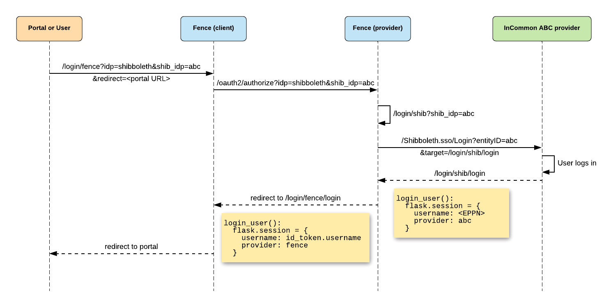

# Shibboleth / InCommon login

Shibboleth Single Sign-On and Federating Software is a standards based, open source software package for web single sign-on across or within organizational boundaries. The Shibboleth software implements widely used federated identity standards, principally the OASIS Security Assertion Markup Language (SAML), to provide a federated single sign-on and attribute exchange framework. It is made up of three components ([docs](https://wiki.shibboleth.net/confluence/display/CONCEPT/Home)):
- The Identity Provider (IdP) is responsible for user authentication and providing user information to the Service Provider (SP). It is located at the home organization, which is the organization which maintains the user's account.
- The Service Provider (SP) is responsible for protecting an online resource and consuming information from the Identity Provider (IdP). It is located at the resource organization.
- The Discovery Service (DS) helps the Service Provider (SP) discover the user's Identity Provider (IdP). It may be located anywhere on the web and is not required in all cases.

Shibboleth is part of the InCommon Trusted Access Platform, an IAM software suite that is packaged for easy installation and configuration. InCommon operates the identity management federation for U.S. research and education, and their sponsored partners. InCommon uses SAML-based authentication and authorization systems (such as Shibboleth) to enable scalable, trusted collaborations among its community of participants.

To enable InCommon login, Shibboleth must be set up in a multi-tenant Fence instance, which lets us log in through InCommon by specifying the `shib_idp` parameter (as of Fence release 4.7.0 and Fenceshib release 2.7.2). If no `shib_idp` is specified (or if using an earlier Fence version), users will be redirected to the NIH login page by default.

Note that in Fence, we use the terms "Shibboleth" and "InCommon" interchangeably.

## Login flow

The `/login/fence` endpoint (multi-tenant Fence login endpoint) accepts the query parameters `ipd` and `shib_idp`. If `idp` is set to `shibboleth`, Fence adds the `ipd` and `shib_idp` parameters to the authorization URL before redirecting the user.

The `/authorize` endpoint accepts the query parameters `ipd` and `shib_idp`. If `idp` is set to `shibboleth`, Fence adds the `shib_idp` parameter to the login URL before redirecting the user.

The `/login/shib` endpoint accepts the query parameter `shib_idp`. Fence checks this parameter to know which Shibboleth identity provider to use (by default, if no `shib_idp` is specified, NIH is used by default).

After the user logs in and is redirected to `/login/shib/login`, we get the `eppn` (EduPerson Principal Name) from the request headers to use as username. If the `eppn` is not available, we use the `persistent-id` instead.



Notes about the NIH login implementation:
- NIH login is used as the default when the `idp` is fence and no `shib_idp` is specified (for backwards compatibility).
- NIH login requires special handling because it uses slightly different login endpoints than other InCommon providers.
- When a user logs into NIH with an eRA commons ID, only the `persistent-id` is returned. For other NIH logins, both `eppn` and `persistent-id` are returned. When a user logs in through NIH, we use the `persistent-id` as the username even when the `eppn` is provided for backwards compatibility.

## Configuration

### In the multi-tenant Fence instance

The [Shibboleth dockerfile](../DockerfileShib) image is at https://quay.io/repository/cdis/fence-shib and is NOT compatible yet with python 3/the latest Fence (for now, use Fence 2.7.x).

The deployment only includes `revproxy` and `fenceshib`. The Fence configuration enables the `shibboleth` provider:

```
OPENID_CONNECT:
  shibboleth:
    [...]
ENABLED_IDENTITY_PROVIDERS:
  providers:
    shibboleth:
      name: Shibboleth Login
```

Note that because Fenceshib is not compatible with the latest Fence yet, we must use the deprecated `ENABLED_IDENTITY_PROVIDERS.providers` field instead of the newer `LOGIN_OPTIONS` section.

The Shibboleth configuration can be checked inside the Fenceshib pod under `/etc/shibboleth/`.

**Warning:** Shibboleth login does not work if there are more than one replica, or if logging in through a canary.

### In the Commons which is set up with InCommon login

You will need to register this Fence as an OIDC client to the multi-tenant Fence using [this `fence-create` command](https://github.com/uc-cdis/fence#register-internal-oauth-client), the redirect url should be `<COMMONS_URL>/user/login/fence/login`.

The Fence configuration enables the `fence` provider (multi-tenant Fence setup) with the `shibboleth` provider (provider to be used by the multi-tenant Fence instance):
```
OPENID_CONNECT:
  fence:
    [...]
```

Setup example:
```
LOGIN_OPTIONS:
  - name: 'NIH Login by default'
    idp: fence
  - name: 'NIH Login'
    idp: fence
    fence_idp: shibboleth
    shib_idps:
      - urn:mace:incommon:nih.gov
  - name: 'UChicago Login'
    idp: fence
    fence_idp: shibboleth
    shib_idps:
      - urn:mace:incommon:uchicago.edu
  - name: 'InCommon Login list'
    idp: fence
    fence_idp: shibboleth
    shib_idps:
      - urn:mace:incommon:nih.gov
      - urn:mace:incommon:uchicago.edu
  - name: 'InCommon Login all'
    idp: fence
    fence_idp: shibboleth
    shib_idps: '*'
```

Several login options can use the same provider (`idp`). Each option that uses the `fence` provider and the `shibboleth` Fence provider (`fence_idp`) can specify one or more InCommon IDPs `shib_idps` in a list, _or_ the wildcard string `'*'` to enable all available InCommon IDPs (be careful not to omit the quotes when using the wildcard). If no `shib_idps` are specified, Fence will default to NIH login.

## Known issues

Both or neither `fence_idp` and `shib_idps` need to be configured for NIH login to work. If `fence_idp` is configured but `shib_idps` is not, a `shib_idp=None` parameter is appended to the redirect URL and user login fails.

```
LOGIN_OPTIONS:
  - name: 'NIH Login by default'
    idp: fence
  - name: 'NIH Login'
    idp: fence
    fence_idp: shibboleth
    shib_idps:
      - urn:mace:incommon:nih.gov
  - name: 'Do not do this'
    idp: fence
    fence_idp: shibboleth
```
