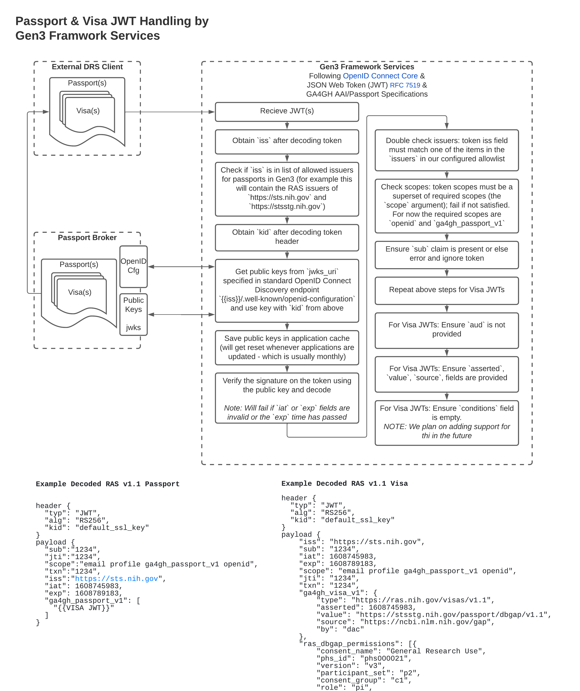
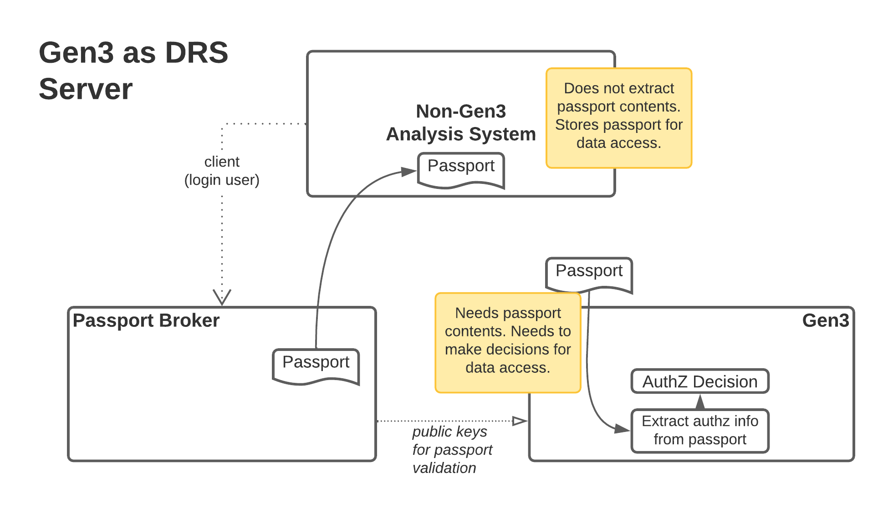
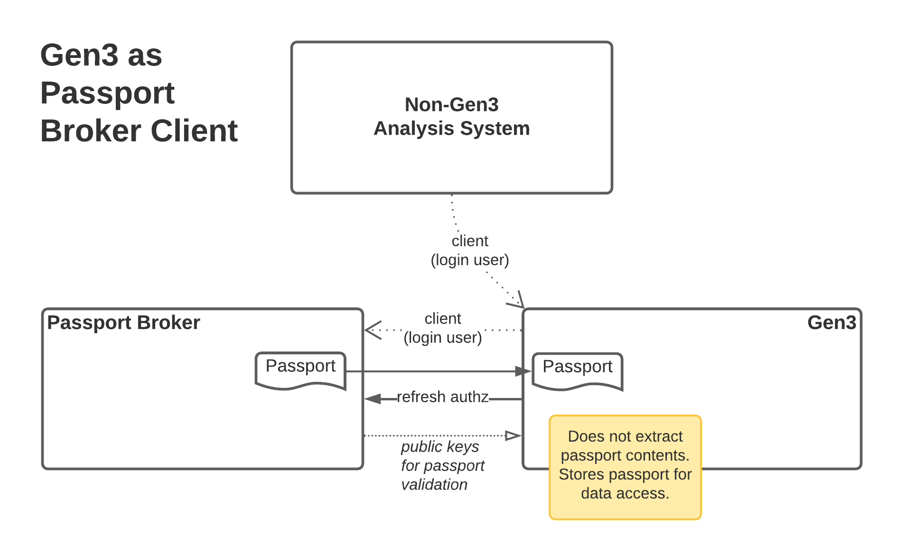
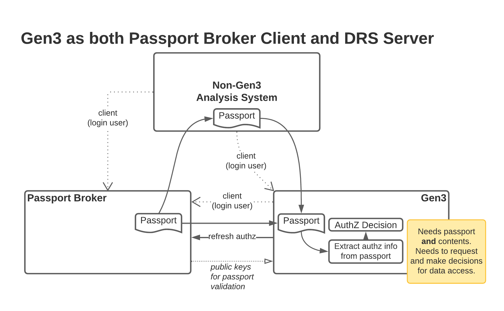
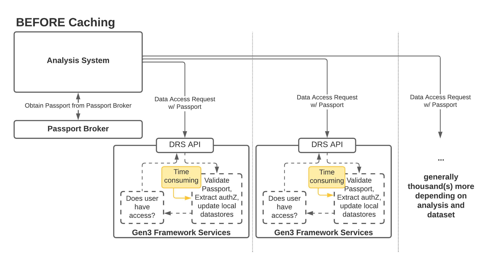
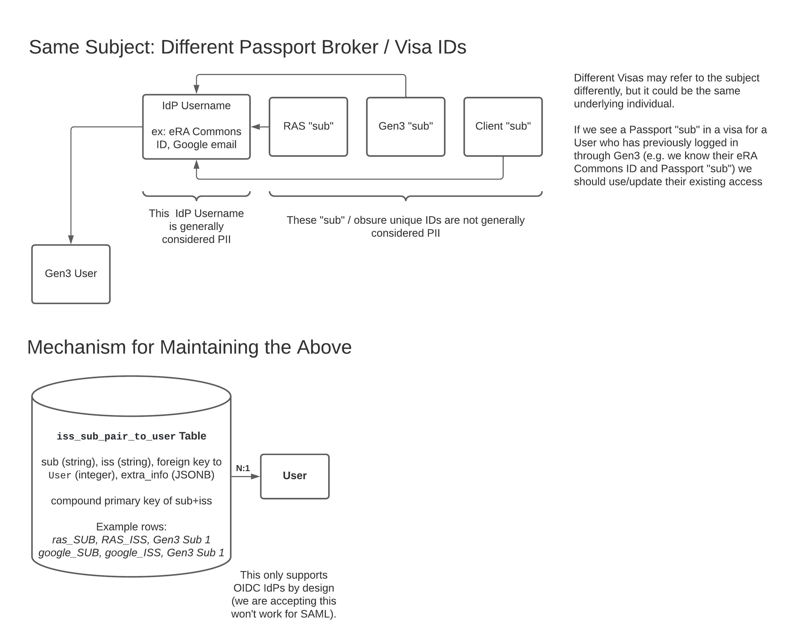
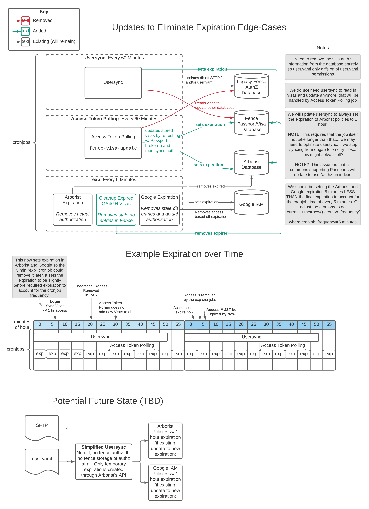

# Passport Support in Gen3 Framework Services (G3FS)

G3FS will support a data access flow accepting Global Alliance for Genomics and Health (GA4GH) Passport(s) as means of authentication and authorization to access file objects.

For National Institutes of Health (NIH) data, we will no longer rely on dbGaP User Access Telemetry files from the hourly usersync for authorization, but instead on NIH's Researcher Auth Service (RAS) Passports.

The adoption of GA4GH specifications across NIH-funded Platforms is a strategic initiative that is pushed for on numerous fronts.

> Our overall goal is interoperability through accepted standards (like GA4GH).

As we are a GA4GH Driver Project, throughout the process of implementing passport support, we have identified numerous gaps and concerns with GA4GH’s specifications along the way. We are at a point now where most have been either addressed, waived, risks accepted, or solutions punted to a future version. There are ongoing discussions about modifications for the future.

Please refer to official documentation about RAS Milestones for all historic and official decisions and designs related to RAS. This document will serve as an **unofficial technical overview** to maintainers of Gen3 and **may not be updated as regularly or represented as clearly as other public facing documents**.

## Passport and Visa JSON Web Token (JWT) Handling

Overview of the standards-based verification and validation flow for JWTs.

References:

* [GA4GH AAI](https://github.com/ga4gh/data-security/blob/master/AAI/AAIConnectProfile.md)
* [GA4GH Passport](https://github.com/ga4gh-duri/ga4gh-duri.github.io/blob/master/researcher_ids/ga4gh_passport_v1.md)
* [OpenID Connect Core](https://openid.net/specs/openid-connect-core-1_0.html)
* [Internet Engineering Task Force (IETF) RCF: JSON Web Token (JWT)](https://datatracker.ietf.org/doc/html/rfc7519)

This shows external DRS Client(s) communicating with Gen3 Framework Services (as a GA4GH DRS Server) and how G3FS interacts with Passport Brokers to validate and verify JWTs.

## G3FS: Configurable Roles for Data Access

Gen3 Framework Services are capable of acting in many different roles. As data repositories (or DRS Servers in GA4GH terminology), as authorization decision makers (GA4GH Claims Clearinghouses), and/or as token issuers (GA4GH Passport Brokers). G3FS is also capable of being a client to other Passport Brokers. G3FS must be a client to an upstream Identity Provider (IdP) as it does not ever store user passwords but relies on authentication from another trusted source.

In order to describe the role of the passport in these various configurations, the following diagrams may help.

## Performance Improvements

In some respect, the support for passports required an auth re-architecture to:

1. accept third-party generated token(s) to be a source of truth for authentication  and authorization
2. parse that authorization information at the time of data access request (rather than synced before)

Passports can be provided to our data access APIs before we've ever seen that user, whereas previously we used to bulk sync all authorization **before** data access (behind the scenes as a cronjob). Becuase of this new, dynamic authorization decision making upon data requests, we knew that we'd need to take extra steps to ensure non-degraded performance.

We added a number of things to mitigate the performance impact on researchers' workflows. Most notably, we introduced a cache for valid passports such that when we recieve thousands of requests to access data and the _exact same_ passport is sent thousands of times over a few minutes, we are able to validate and parse it once and rely on that for subsequent requests. The cache only lives as long as policy and standards allow (which is usually less than an hour).

To illustrate the need for such a cache, see the images below for before and after.

## User Identities

Different GA4GH Visas may refer to the same subject differently. In order to maintain the known mappings between different representations of the same identity, we are creating an Issuer+Subject to User mapping table. The primary key on this table is the combination of the `iss` and `sub` from JWTs.

## Backend Updates and Expiration

In order to ensure the removal of access at the right time, the cronjobs we have are updated based on the figure and notes below. We are requiring movement away from the deprecated, legacy, limited Fence authorization support in favor of the new policy engine (which allows expiration of policies out of the box).

There is an argument here for event-based architecture, but Gen3 does not currently support such an architecture. We are instead extending the support of our cronjobs to ensure expirations occur at the right time.

> _All diagrams are originally from an **internal** CTDS Document. The link to that document is [here](https://lucid.app/lucidchart/5c52b868-5cd2-4c6e-b53b-de2981f7da98/edit?invitationId=inv_9a757cb1-fc81-4189-934d-98c3db06d2fc) for internal people who need to edit the above diagrams._
