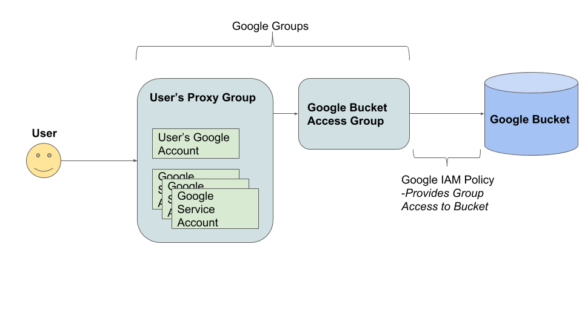
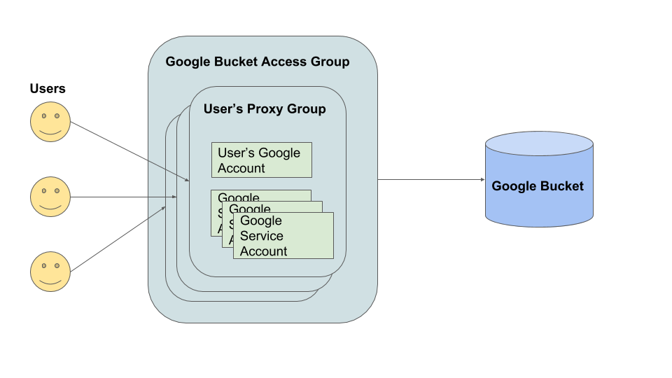
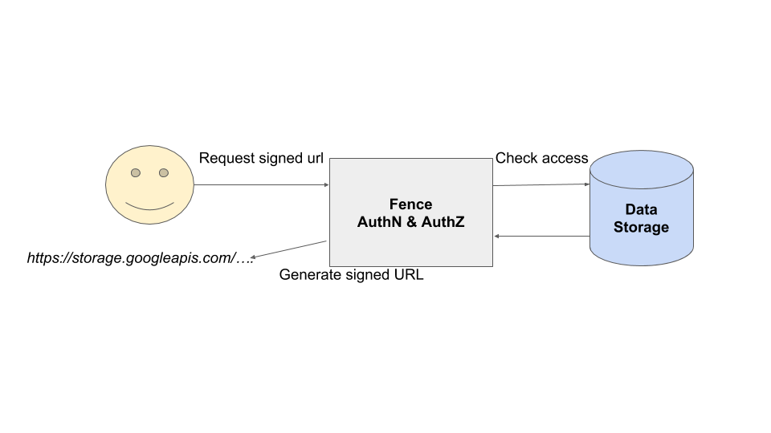
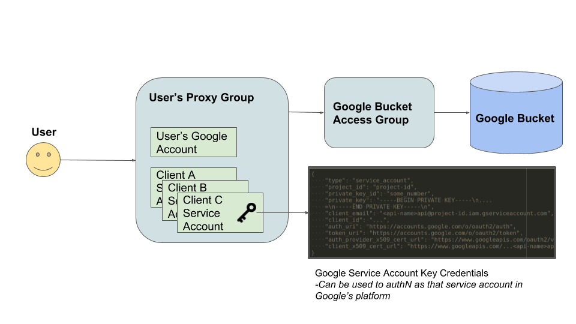
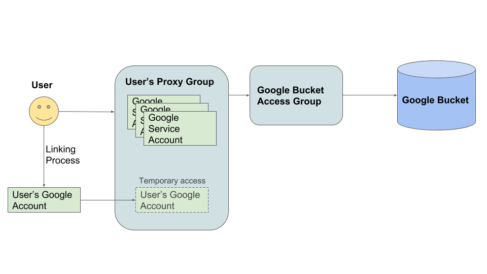
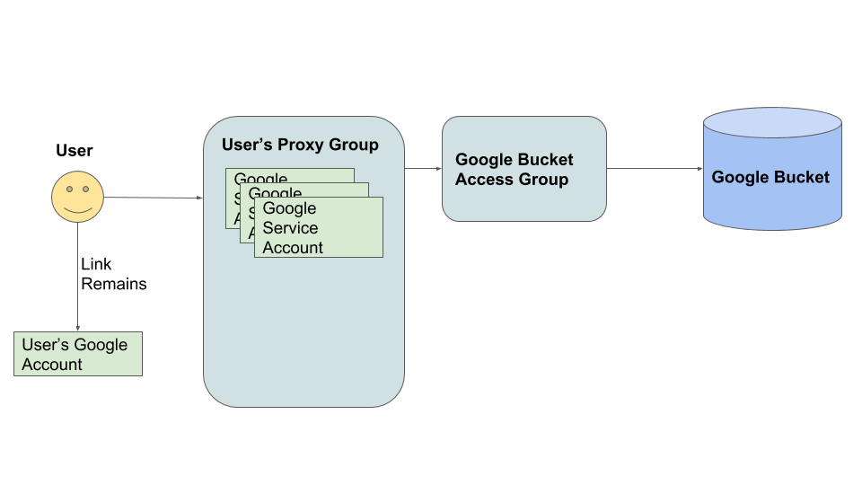
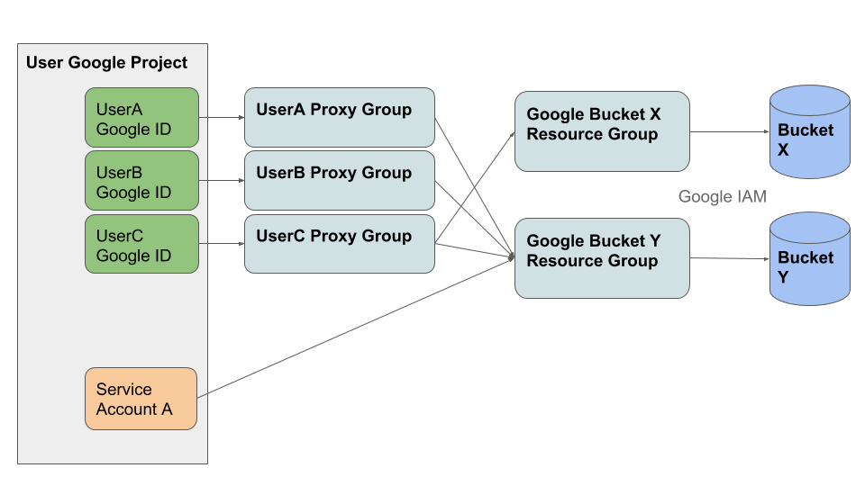

# Fence and Google

## Data Access Overview

Fence can issue short lived, cloud native credentials to access data in various cloud storage services. For Google, there are a handful of data access methods:

1. [Signed URLs](#signed-urls)
    * Generate URLs that provide temporary, authenticated, access to anyone with the URL
2. [Temporary Service Account Credentials](#temporary-service-account-credentials)
    * Grant temporary access to authorized data via Google Service Account (for use in Google's Cloud Platform)
3. [Google Account Linking and Service Account Registration](#google-account-linking-and-service-account-registration)
    * Grant end-user Google Accounts and Google Projects temporary access to authorized data

We'll talk about each one of those in-depth here (and even delve into the internal details a bit). First, we'll take an overall look at the Fence + Google architecture.

## Implementation and Architectural Details

### Fence -> cirrus -> Google: A library wrapping Google's API

We have a library that wraps Google's public API called [cirrus](https://github.com/uc-cdis/cirrus). Our design is such that fence does not hit Google's API directly, but goes through cirrus. For all of cirrus's features to work, a very specific setup is required, which is detailed in cirrus's README.

Essentially, cirrus requires a Google Cloud Identity account (for group management) and
Google Cloud Platform project(s). In order to automate group management in Google Cloud Identity with cirrus, you must go through a manual process of allowing API access and delegating a specific service account from a Google Cloud Platform project to have group management authority. Details can be found in cirrus's README.

Once cirrus has access to manage groups and is configured with proper credentials to access a Google Cloud Platform project, you can use the Python library within Fence.

### Data Access: Google Architecture

To support the 3 methods of access mentioned above, we have a generic architecture that provides linkage between an end-user and rights to access a Google Storage bucket.

That architecture involves Google's concept of **groups** and use of their **IAM Policies** in the Google Cloud Platform. The following diagram shows the layers between the user themselves and the bucket.

Working backwards from the Google Bucket itself, we have a **Google Bucket Access Group**, which, as you probably guessed, is a Google Group that provides access to the bucket. That group is assigned a **role** on the Google **resource** (the Google Bucket). **Roles** provide a set of permissions (like read privileges). The combinations of those roles on the bucket become the bucket's **Policy**. You can read more about Google's IAM terms and concepts in [their docs](https://cloud.google.com/iam/docs).

The important thing to note here is that *any* entity inside that Google Bucket Access Group (GBAG) will have whatever role/permissions were set between the GBAG and the Bucket itself with Google's IAM.

So, now we can control access to the bucket by adding and removing entities from the GBAG (instead of having to modify the bucket's IAM Policy all the time). This is, in fact, the way Google recommends dynamically controlling access to a bucket.

> NOTE: The `fence-create` command line tool has helpful methods for creating new buckets (which automates the creation of these GBAGs). Check out `fence-create --help` and search for sub-commands with `bucket` in their name. You can get more details for a subcommand with `fence-create <sub-command> --help`.

#### Groups within Groups

Google groups contain **members** (another Google term) and a Google group can be a member. This means that you can nest Google groups, e.g. have groups inside of other groups.

A more representative diagram of the structures that allow users to get access to the buckets may look something like this:

#### User's Proxy Group

Each user is associated with a *single* Google Group (a 1:1 relationship). This group serves as a sort of proxy to get access. Thus, we've dubbed this a **User Proxy Group**. It contains all the entities that should have identical data access as the user themselves.

This means that other Google accounts (like a personal email) can be in this User Proxy Group. That capability is used in the **Google Account Linking and Service Account Registration** access method.

The User Proxy Groups also allows a central location for Google Service Accounts that are given the same access as the user (which are used for the **Temporary Service Account Credentials** and **Signed URL** access method).

This makes the granting and removal of data access for a given user very simple. Just remove their Proxy Group from a Google Bucket Access Group. All entities that had access to the bucket no longer have access.

### Crash Course: Fence Clients

Fence supports OpenID Connect / Oauth2 flows to allow outside applications to request access to user's data and perform actions on their behalf. Users **must** consent to this before the outside application is given access.

The Google Access methods mentioned above all require special client scopes (which allow the client to ask the user for this access), and the user must consent to the client using these methods.

The scopes that allow access to these methods are also available for individual users without going through an outside application. This means that users themselves are able to hit these endpoints to get access via the 3 different methods.

> NOTE: When these docs talk about `clients` accessing data, it's reasonable to assume that this means both `clients` and `users` themselves. Much of the algorithms behave similarly if the user themselves were to request access without going through an outside application.

## Data Access Methods

### Signed URLs

Fence facilitates the creation of Signed URLs to access Google Storage objects. These URLs provide temporary, authenticated, access to anyone with the URL but must be generated by someone who has access.

Design Requirements:

* Resulting URL can be traced back to the user who created it
    * For security / logging purposes
* Clients and Users should maintain the ability to manage as many service account keys as possible
    * Google's limit is 10 keys per Service Account
    * Want to make sure we're not creating a *new* key every time a signed URL is requested

To meet these requirements, we use a single service account key generated for the user's **Primary Service Account** to sign the URL. In this way, we can trace back the URL to a given user (since the Primary Service Account email is guaranteed to contain the `user_id`). For details on Primary Service Accounts, continue reading the [Temporary Service Account Credentials](#temporary-service-account-credentials) section.

We also make sure that the key we use for URL signing has a later expiration time than when users create their own keys (although this is configurable in fence). By default, the key used for signing URLs lasts 30 days, while service account keys created by users for the Primary Service Account last 7 days.

Fence manages the rotation of the key for URL signing automatically.

### Temporary Service Account Credentials

Fence allows clients (and users themselves) to generate temporary credentials which they can use in Google's Cloud Platform to access data that the user has access to. This is done by using Google's **Service Accounts** and generating a **Service Account Key** to provide to the client. This key will allow the client to authenticate as that service account (which is controlled by Fence).

Each client (AKA outside application) will get their own **Client Service Account** that is associated directly with a given user. In other works, there's a one-to-many relationship between a user and their Client Service Accounts.

This allows clients to manage their temporary credentials without the chance of interfering with another client's. Fence provides capability to create and delete these keys through its API.

Each Client Service Account is a member in the User's Proxy Group, meaning it has the same access that the user themselves have.

> WARNING: By default, Google Service Account Keys have an expiration of 10 years. To create a more manageable and secure expiration you must manually "expire" the keys by deleting them with a cronjob (once they are alive longer than a configured expiration). Fence's command line tool `fence-create` has a function for expiring keys that you should run on a schedule. Check out `fence-create google-manage-keys --help`

Note that internally, we handle users themselves generating these temporary credentials differently. A user is given a **Primary Service Account** which is essentially the same thing as a Client Service Account, but is meant for use solely by the user themself (e.g. not going through a client or outside applcation but hitting the API directly).

At the moment, we track keys generated for the Primary Service Account in our db. Client Service Accounts are expired by checking their creation time through Google's API.

One special use-case for the Primary Service Account is its use for signing URLs.

### Google Account Linking and Service Account Registration

There are two steps in this access method but they are related. If you want to access data directly by signing in with your Google account, then you can just do the **Google Account Linking**.

If, however, users have their own Google Projects and want to provide access to data inside those projects, they can go through **Service Account Registration** to provide a Google Service Account with temporary access to the data. This allows users to spin up virtual machines in their own projects and run computations on data they have access to.

While Service Account Registration may provide the most flexibility, it is also the hardest to monitor and ensure security of data. Thus, *clients and users who wish to use this access method must adhere to very specific setup instructions, configurations, and rules restricting certain features of Google's Cloud Platform*.

#### Google Account Linking

Fence allows users to "link" a Google Account to their fence identity. Typically, this is necessary where the identity provider that fence uses is *not* Google but you want to provide access to data on Google through the 3 access methods.

---

##### Example:

A user logs into fence with their eRA Commons ID. To get access to data through their Google Account (ex: `foobar@gmail.com`) they would then need to link that Google Account with their eRA Commons ID user in fence.

> NOTE: A Google Account is any account with a `gmail.com` address **or** any other domain using Google's GSuite or Google Cloud Identity. So your `foobar@university.edu` email address *may* be a Google Account if the university uses GSuite or Cloud Identity to provide you with email.

---

Google Account Linking is achieved by sending the user through the beginning of the OIDC flow with Google. The user is redirected to a Google Login page and whichever account they succesfully log in to becomes linked to their fence identity.

We require the user to log in so that we can authenticate them and only link an account they actually own.

Once linked, the user's Google Account is then placed *temporarily* inside their Proxy Group. This means that the user could log into Google's Cloud Platform with their Google Account and access data.

> NOTE: The linking process should provide temporary access to data such that explicit refreshing of access is required. In order to remove a linked Google Account from access, you must remove that account from the Proxy Group *manually*. The `fence-create` tool has a script that could be run as a cronjob to accomplish this. Check out `fence-create google-manage-account-access --help` for details.

At the moment, the *link* between the User and their Google Account does not expire. The access to data *does* expire though. Explicit refreshing of access must be done by an authenticated user or valid client with those permissions through Fence's API.

#### Service Account Registration

This allows a user to create their own personal Google Cloud Project and register a Google Service Account from that project to have access to data. While this method allows the most flexibility, it is also the most complicated and requires strict adherence to a number of rules and restrictions.

This method also requires Fence to have access to that user's Google project. Fence is then able to monitor the project for any anomalies that may unintentionally provide data access to entities who should not have access.

In order to register a Service Account, *all* users in the Google Project must have already gone through Google Account Linking (as desribed above). After that, any user on the project can attempt to register a service account with fence.

---

#### Google Project and Service Account Validity Checking

In order to register a Service Account, the Service Account and its associated Project must pass a series of validity checks.

Projects are always validated against the following checks:
* Fence monitor has access to project
   * Key: `monitor_has_access`
   * Checks if the Fence monitoring service account can access the Google Project.
* User has access to project
   * Key: `user_has_access`
   * Checks if the current user is an authorized member on the project.
* Google Project has valid parent organization
   * Key: `valid_parent_org`
   * Checks if the Google project either has no parent organization, or if it does, it is included on the whitelist of parent. organizations (defined in Fence config).
* Google Project only has valid member types
   * Key: `valid_member_types`
   * Checks if the Google project ony has members that are User Accounts or Service Accounts.
* Google Project members exist in fence
   * Key: `members_exist_in_fence`
   * Checks if the User members on the Google project exist in the fence DB
* Google Project has valid service accounts
   * Key: `service_accounts`
   * Checks if the Service Account members on the project pass the Service Account validity checks detailed below.
  
Service Accounts on the project, as well as the Service Account being registered, are validated against some combination of the following checks (which checks occur ultimately depend on the type of Service Account and whether or not the Service Account is currently being registered or not).

* Service Account is owned by Google Project identified in the request
   * Key: `owned_by_project`
   * Checks if the Service Account is owned by the project
* Service Account is of valid type for registration
   * Key: `valid_type`
   * Checks if the Service Account is a User Managed Service Account or a Compute Engine API Service Account
* Service Account policy is accessible
   * Key: `policy_accessible`
   * Checks if  fence's monitoring Service Account can read the Service Account's policy
* Service Account has no external access
   * Key: `no_external_access`
   * Checks if the Service Account has no IAM roles and no access keys

These checks are applied according to the following logic:

* If the service account is User Managed:
   * check: `owned_by_project`, `valid_type`, `policy_accessible`, `no_external_access`
* ElIf the service account is Google Managed:
   * If the service account is registered or currently being registered:
      * check: `owned_by_project`, `valid_type`, `policy_accessible`
   * ElIf the service account is not registered/being registered and is a member on the project:
      * check: `owned_by_project`
      * Note: `valid_type` is not checked because the Service Account is not being registered. `valid_type` is checked when a Service Account is registered, and the type of a Service Account cannot change. `policy_accessible` is not checked because (1) some Google Managed service accounts do not allow their policies to be read and (2) we assume that the Google Managed accounts that are *not* registered for data access are okay so long as they're in the project security boundary.
   * Note: `no_external_access` is not checked, as a the Service Account is Google Managed and will therefore have roles for use within the Google Cloud Platform

Service Accounts are validated according to this logic regardless of whether or not it is during Service Account registration or the `google-manage-user-registrations` cronjob. However, during the cronjob validation, registered service accounts are validated before their respective project is validated.

The Service Accounts are validated first in the cronjob so that if multiple SA's are registered and only one is non-conforming, we can remove that single account without invalidating the entire project. If the project as a whole is invalid, we must remove all SAs though.

---

##### Example:

This diagram shows a single Google Project with 3 users (`UserA`, `UserB`, and `UserC`). All of them have already gone through the linking process with fence to associate their Google Account with their fence identity.

The project service account, `Service Account A`, has been registered for access to a fence `Project` which has data in `Bucket Y`. The service account is given access by placing it *directly in the Google Bucket Access Group*.

Now, by using `Service Account A`, any user in the project (`UserA`, `UserB`, and `UserC`) can access data in `Bucket Y` (in a Compute Engine Virtual Machine for example).

The user must request fence `Projects` that the service account should have access to. *Everyone* on the Google Project **must** have access to those fence `Projects` or registration will be invalid. This ensures that everyone on the project actually has access to the data the service account is allowed to access.

---

##### Example:

If someone attempting to register `Service Account A` with fence `Projects` that have data in *both* `Bucket X` and `Bucket Y`, registration will fail. Why? Because not every user in the Google Project have access to that data.

---
