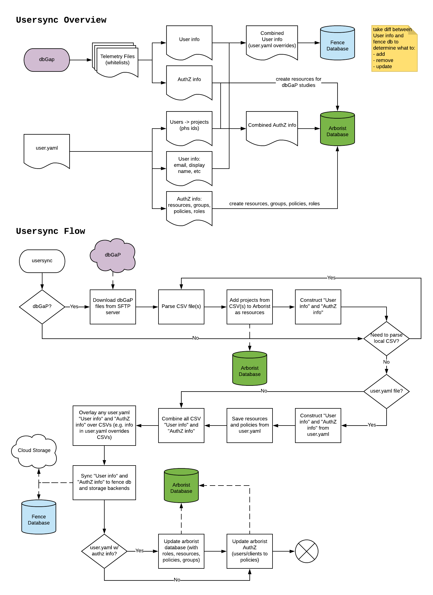

# Usersync

Usersync is a script that parses user access information from multiple sources (user.yaml files, dbGaP user authorization "telemetry" files AKA whitelists) and keeps users' access to Gen3 resources up to date by updating the Fence and Arborist databases.


## Usersync flow



> The access from the user.yaml file and the dbGaP authorization files is combined (see example below), but the user.yaml file overrides the user information (such as email) obtained from the dbGaP authorization files.

## Configuration

Configuration for user sync lives in fence-config.yaml for each respective environment. An example of the fence-config can be found [fence/config-default.yaml](https://github.com/uc-cdis/fence/blob/master/fence/config-default.yaml).

You can configure one or more dbGaP SFTP servers to sync telemetry files from. To configure one single dbGaP server, add credentials and information to the fence-config.yaml under `dbGaP`, this is outlined in [here](https://github.com/uc-cdis/fence/blob/4.14.0/fence/config-default.yaml#L389-L433)

To configure additional dbGaP servers, include in the config.yaml a list of dbGaP servers under `dbGaP`, like so:

```
dbGaP:
- info:
    host:
    username:
    password:
    ...
  protocol: 'sftp'
  ...
  ...
- info:
    host:
    username:
    ...
```

An example can be found in the config used for unit testing [tests/test-fence-config.yaml](https://github.com/uc-cdis/fence/blob/master/tests/test-fence-config.yaml)

## Usersync result example

### Example of user.yaml file:

<details>
    <summary>Expand user.yaml</summary>

```
# authz information follows the attribute-based access control (ABAC) model
authz:
  resources:
    - name: programs
      subresources:
        - name: myprogram
        - name: phs1
        - name: phs2
        - name: phs3
    - name: 'open'

  policies:
    - id: 'open_data_reader'
      description: 'Read access to open data'
      role_ids:
        - 'reader'
        - 'storage_reader'
      resource_paths: ['/open']
    - id: phs1_phs2_reader
      description: "Read access to ph1 and ph2"
      role_ids:
        - reader
      resource_paths:
        - /programs/phs1
        - /programs/phs2
    - id: phs3_creator
      description: "Create access to ph3"
      role_ids:
        - creator
      resource_paths:
        - /programs/phs3
    - id: phs1_admin
      description: "Admin access to ph1 indexd records"
      role_ids:
        - indexd_record_admin
      resource_paths:
        - /programs/phs1

  roles:
    - id: reader
      description: ""
      permissions:
        - id: reader
          action:
            method: read
            service: "*"
    - id: storage_reader
      description: ""
      permissions:
        - id: storage_reader
          action:
            method: read-storage
            service: "*"
    - id: creator
      description: ""
      permissions:
        - id: creator
          action:
            method: create
            service: "*"
    - id: indexd_record_admin
      description: ""
      permissions:
        - id: indexd_record_admin
          action:
            method: "*"
            service: indexd

  # policies automatically given to anyone, even if they are not authenticated
  anonymous_policies:
    - open_data_reader

  # policies automatically given to authenticated users (in addition to their other policies)
  all_users_policies: []

  groups:
    - name: phs1_phs2_readers
      policies:
        - phs1_phs2_reader
      users:
        - ABC
        - DEF

# OIDC clients
clients:
  client1:
    policies:
      - open_data_reader

users:
  ABC:
    # "admin" gives create/update/delete access to programs and projects in Sheepdog
    admin: true
    policies:
      - phs1_admin
    # "projects" is the deprecated way of providing access. We should now use "policies"
    projects:
      - auth_id: myprogram
        privilege:
          - read
          - read-storage
          - write-storage
  GHI:
    admin: false
    policies:
      - phs3_creator
```
</details>

### Example of dbGaP authorization file (CSV format):

```
user name, login, authority, role, email, phone, status, phsid, permission set, created
Mr. DEF,DEF,eRA,PI,def@com,"123-456-789",active,phs3.v2.p3.c4,"General Research Use",2013-03-19 12:32:12.600
Mrs. GHI,GHI,eRA,PI,ghi@com,"123-456-789",active,phs3.v2.p3.c4,"General Research Use",2013-03-19 12:32:12.600
```

Usersync gives users "read" and "read-storage" permissions to the dbGaP studies.

> Note: The dbGaP authorization files contain consent codes that can be parsed by usersync: [more details here](dbgap_info.md). This simplified example does not include consent code parsing.

### Resulting access:

- user ABC:
  - /open: read + read-storage
  - /programs/myprogram: read, read-storage, write-storage
  - /programs/phs1: read + all methods on indexd
  - /programs/phs2: read
- user DEF:
  - /open: read + read-storage
  - /programs/phs1: read
  - /programs/phs2: read
  - /programs/phs3: read + read-storage _(from the dbGaP authorization file)_
- user GHI:
  - /programs/phs3: read + read-storage + create _(user.yaml access combined with dbGaP authorization file access)_

## Validation

The [gen3users CLI](https://github.com/uc-cdis/gen3users) includes a user.yaml validation tool:
```
pip install gen3users
gen3users validate user.yaml
```
